# 增量设计：文件管理 / 文档管理 / 设置 / 日志 / 日历 / 关系图 六维整改

| 项 | 内容 |
| --- | --- |
| 需求名称 | 文件管理 + 文档管理 + 设置可用性 + 日志系统 + 日历 + 关系图 整改 |
| 文档类型 | 增量系统设计（架构师：高见远） |
| 上游输入 | `docs/file-and-settings-incremental-prd.md`（879 行，已通读）；用户已拍板 4 项决策 |
| 参考格式 | `docs/shortcuts-incremental-design.md`（上一轮增量设计，颗粒度对齐） |
| 项目 | choyeon-note（Electron + Vue 3 `script setup` + Pinia + CodeMirror 6 + Vite + Tailwind） |
| Language | 中文 |
| 基线 | `npx vitest run` **8 files / 174 passed**；`node tmp/smoke.mjs` **ERRORS(0)** |
| 范围约束 | **不引入任何新第三方依赖**（含日志库，见 §5）；不重写全量需求，只描述变更部分 |

---

## 0. 用户已拍板决策的落地对照

| # | 决策 | 本设计落地方式 | 涉及模块 |
| --- | --- | --- | --- |
| 1 | **稳定 id 双轨** | `src/utils/noteIdentity.js`：`id ↔ path` 映射表存 `userData/note-id-map.json`（IPC `idmap:*`），**绝不写用户 .md**；`pathHashId(path)` 作迁移期兜底解析；`rebuildIdMap()` 支持全量重建 | M1 / §3.1 |
| 2 | **日期四级回落** | `src/utils/dateAttribution.js`：`frontmatter.date` → `birthtime` → 标题日期串 → `updatedAt`；`src/utils/dateMigration.js` 一次性固化进 frontmatter，flag `choyeon-date-migration-v1` 防重跑；日历与排序统一走 `resolveNoteDate()` | M2 / §3.2 |
| 3 | **定向 reconcile 与默认值同批** | `src/composables/useExternalSync.js` 把 `loadNotesFromPath` 换成按变更文件定向处理；`storage.js` `autoSync` fallback 改 `true` **与 reconcile 同一任务**（T24），两者不可拆 | M1 / §3.1 |
| 4 | **删除保留策略** | 默认 `shell.trashItem` 系统回收站；不可用退化为库内 `.trash` 保留 **30 天**；`trashIndex.js` 提供「最近删除」可还原 | M2 / §3.2 |
| 补 | **关系图双链为一等边** | `src/utils/graphLinks.js`：wiki 边 weight 3、tag 2、similar 0.5；提供「仅双链」开关；相似度边降权保留 | M6 / §3.6 |

---

## 1. 实现方案总览

**一句话**：在「不动用户 .md 文件」的前提下，用四个新的**纯函数内核**（文件命名、稳定标识、日期归属、日志+脱敏）替换散落在 store / view / 主进程里的临时逻辑，再把唯一一个高风险改动（磁盘监听）从「整库全量重载」改成「定向 reconcile + 冲突提示」，最后让日历与关系图消费这批新内核。

**三条贯穿本轮的架构原则**：

1. **纯内核优先**：凡是能写成「零 import、可单测」的逻辑（文件名合法化、id 解析、日期归属、脱敏、网格计算、图边构建）一律独立成 `src/utils/*.js`，store / view 只做接线。这是本轮并行度的来源——纯内核任务彼此零文件重叠。
2. **共享文件串行化**：`src/stores/note.js`、`electron/main.cjs`、`src/components/Sidebar.vue`、`src/views/SettingsView.vue` 是天然瓶颈。**每个批次内只允许一个任务拥有它们，跨批次按批次顺序交接**（批次本身是串行验收闸门）。
3. **reconcile 绝不静默覆盖**：判定基准是 `note.js:37` 的 `dirtyNotes` 集合——「磁盘变了 且 内存脏」= 冲突，交给用户选；「磁盘变了 且 内存不脏」= 定向同步。

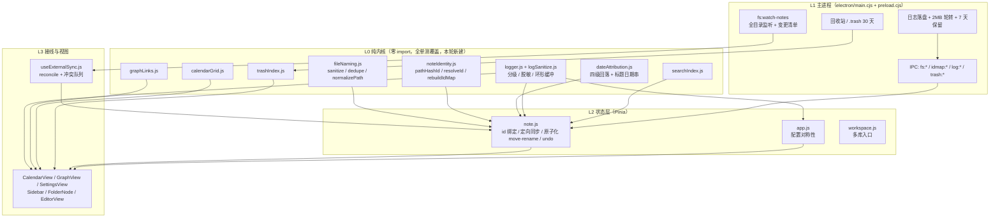

---

## 2. 现状补充核查（PM 标注未核查的 6 项，逐项给证据）

### 2.1 EditorView.vue（880 行全文）未保存编辑的丢弃 / 恢复策略

**结论：没有「丢弃确认」，也没有「草稿恢复」。存在一条已存在的静默覆盖链，它直接决定 reconcile 的验收口径。**

证据链（四跳，逐跳实测）：

| 跳 | 位置 | 行为 |
| --- | --- | --- |
| ① | `src/views/EditorView.vue:762-766` | `watch(() => currentNote.value?.content, next => { if (typeof next === 'string' && next !== content.value) content.value = next })` —— **store 里的 note.content 一变，编辑器本地 buffer 立即被覆盖** |
| ② | `src/components/MarkdownEditor.vue:129-131` | `watch(() => props.modelValue, val => { if (val !== content.value) setContent(val) }, { flush:'post' })` —— buffer 一变就 `setContent()` 灌进 CodeMirror，光标归零 |
| ③ | `src/views/EditorView.vue:769-773` | `watch(() => noteStore.notes.length)`：`currentNote` 变 null 且库非空 → `loadFromRoute()` → **强制跳到 `notes[0]`** |
| ④ | `src/stores/note.js:521-522` | `deleteFolder` 内：`currentNoteId` 若在新库里找不到 → `currentNoteId.value = notes.value[0]?.id` —— 同样强制跳首篇 |

**唯一的保护**是 `EditorView.vue:354-363` 的 `onContentChange`：当 `!currentNote?.id` 时弹 toast「当前笔记已失效，改动未保存」并 `return`。也就是说 **id 失效 = 编辑被静默丢弃**（只弹一个 toast，不保存、不恢复）。

**对 R-F5 验收口径的直接约束**（写死，工程师照此实现）：

- **R-F5 的硬口径：reconcile 不得改变 `currentNoteId` 对应笔记的 `content` 字段，除非用户已在冲突弹窗中做出选择。** 只要不碰 `note.content`，①②两跳就不会触发，打字中的人与光标都安全。
- `:doc-key="currentNote?.id || ''"`（`EditorView.vue:104`）→ `MarkdownEditor.vue:175-178` 的 `watch(docKey)` 只跑 `forceRefreshSpell()`，**不会重建文档**。所以 id 变化本身不丢光标；真正丢光标的是 ①②（content 被改）。
- **`R-F5` 的「外部重命名/移动」子场景依赖 `R-F1`**：路径哈希 id 在移动后会变 → `currentNote` 查不到 → 触发 ③ → 被拽到首篇。**这不是 PM 说的「软依赖」，是本轮必须按 批次3 → 批次4 顺序执行的硬理由之一**（另一个是日志）。
- 现有「离开编辑器落盘」保护只有 `EditorView.vue:808-816` 的 `onUnmounted → flushSave`，以及 `App.vue:286-296` 的 `before-quit → app:flush-all`。**没有 `beforeunload` 级别的二次确认**，本轮也不新增（避免与自动保存开关语义打架）。

### 2.2 vault.js（479 行）+ VaultView.vue —— 日志脱敏规则必查对象

**结论：vault 的敏感面比 PM 推断的更宽，但现有代码已有正确的「不泄露」先例可复用。**

| 证据 | 结论 |
| --- | --- |
| `src/stores/vault.js:214-234` `flush()` | Electron 下**只**走 `window.electronAPI.saveVault`，**刻意不写 localStorage**（注释：写了就等于加密白做）。浏览器降级才写 `LS_VAULT='choyeon-kv-vault'` |
| `src/stores/vault.js:87-101` `toPersistable()` | `secret` 条目把 `value` 抽空、换成 `valueEnc`（safeStorage 密文，OS 凭据库加密） |
| `src/stores/vault.js:182-197` `scoreEntry()` | 第 193-194 行：**敏感值不参与内容搜索**，注释明写「避免搜索框成为泄露面」——**这是本轮日志脱敏要对齐的既有口径** |
| `src/stores/vault.js:352-359` `mask()` | 保留首尾少量字符 + 中间 `•`。**日志不能用这套**（首尾字符仍是可复原线索），日志必须整体 `[REDACTED]` |
| `src/stores/vault.js:384-392` `exportEntries()` | 导出**明文 CSV**，含全部 `e.value`。用户主动行为，但 `e.key` 同样是敏感面 |
| `src/stores/vault.js:225` | **vault 里唯一的 console**：`console.error('[vault] 保存失败:', error)`。当前只打 error 对象，**不含明文**——现状安全 |
| `src/stores/vault.js:252-256` `hydrate()` catch | **静默吞异常**：`catch { entries.value = normalize(readLocal(...)) }`。**vault 加载失败目前完全没有日志**——这是 L-1/L-6 的交叉缺口，本轮必须补 |

**据此确定的脱敏字段黑名单**（写进 `logSanitize.js`，§3.4）：

- 绝对禁止入日志：`entry.value`、`entry.valueEnc`、`vaultEncrypt` 的输入/输出、`vaultDecrypt` 的输出
- `secret === true` 的条目：`entry.key`、`entry.note` 一并脱敏（账号名本身也是敏感面）
- `entry.tags` 按普通字符串截断处理

**附带核查（项目硬约束）**：`vault.js:369` 与 `:372` 的 `` `${e.key}\u0000${e.group}` `` —— 经 `od -c` 逐字节确认是 **ASCII 转义文本 `\ u 0 0 0 0`（6 字符），不是裸 NUL 字节**。全量扫描（`src/` + `electron/` + `tests/` 所有 `.js/.vue/.cjs/.css`，node 逐字节）结果：**0 个文件含裸 NUL**。当前合规；**改动 vault.js 时必须保持转义写法，不得改成真 NUL 字符**。

### 2.3 style.css（2598 行）全量 —— S-2 的完整变量差清单

PM 要求给出「`.electron-mode[data-theme='dark']` 到底比 `[data-theme='dark']` 少覆写了哪些变量」的完整清单。用脚本按花括号配准解析四个块，实测结果：

| 选择器 | 行号 | 声明变量数 | PM 估计 |
| --- | --- | --- | --- |
| `:root` | `style.css:5-181` | **141** | — |
| `[data-theme='dark']` | `style.css:221-310` | **73** | 「约 60」 |
| `.electron-mode` | `style.css:1494-1509` | **14** | 「约 15」 |
| `.electron-mode[data-theme='dark']` | `style.css:1511-1526` | **14** | 「只有 12」 |

**差集（在 `[data-theme='dark']` 中声明、但 `.electron-mode[data-theme='dark']` 未覆写的变量）= 59 个，完整清单**：

```
--color-primary              --color-primary-light      --color-primary-lighter
--color-primary-lightest     --color-primary-dark       --color-primary-darker
--color-primary-ring         --color-primary-surface    --color-secondary
--color-secondary-light      --color-secondary-lighter  --color-secondary-lightest
--color-secondary-dark       --color-accent             --color-accent-light
--color-accent-lighter       --state-success            --state-warning
--state-error                --state-info               --color-error-surface
--color-error-surface-hover  --color-success-surface    --color-warning-surface
--color-surface-elevated     --color-border-focus       --color-text-primary
--color-text-secondary       --color-text-tertiary      --color-text-inverse
--color-text-on-primary      --color-text-body          --reading-bg
--shadow-xs                  --shadow-sm                --shadow-md
--shadow-lg                  --shadow-float             --shadow-focus
--shadow-card-hover          --glass-bg                 --glass-border
--titlebar-blur              --titlebar-saturate        --sidebar-blur
--sidebar-saturate           --sidebar-search-bg        --sidebar-search-bg-hover
--sidebar-search-bg-focus    --sidebar-search-border    --sidebar-search-blur
--sidebar-search-saturate    --sidebar-count-bg         --sidebar-count-color
--content-blur               --content-saturate         --card-blur
--card-saturate              --card-shadow
```

**⚠️ 但 PM 对 S-2 的机理描述与实际代码不符，必须回退修正。**

PM 原文：「凡是没有被 `.electron-mode[data-theme='dark']` 显式覆写的变量，会**回落到 `:root` 的浅色值**」。

反证（**级联推导** —— 变量数、行号、取值均为脚本解析与读文件所得；解析值由 CSS 级联规则推导，未跑浏览器渲染验证，因为 Electron 起不来、jsdom 不解析样式表级联）：

1. **DOM 归属**（读码所得）：`electron-mode` 加在 `.app-container` 上（`App.vue:7` `:class="{ 'electron-mode': isElectron }"`），`data-theme` **同时**加在 `.app-container`（`App.vue:4` `:data-theme="currentTheme"`）和 `<html>`（`app.js:687` `document.documentElement.setAttribute('data-theme', ...)`）。
2. **CSS 自定义属性是逐属性级联，不是「块替换」**。`.electron-mode[data-theme='dark']` 特异性 (0,2,0) 只赢它**自己声明的 14 个**；其余 59 个变量它没有声明 → 落到下一条匹配规则 `[data-theme='dark']`（(0,1,0)，行 221 晚于 `:root` 行 5）→ **取到的是深色值**：
   - `--color-text-primary` → `#f1f3f4`（`style.css:262`，深色模式下的浅色文字 ✓）
   - `--reading-bg` → `#1c1d20`（`style.css:268`，深底 ✓）
   - `--color-surface-elevated` → `#303134`（`style.css:255`，深色 ✓）
   - `--shadow-*` → 深色阴影（`style.css:270-276` ✓）
3. 所以 **「深色界面里戳着一块浅色卡片」这个 P0 症状，按 PM 描述的机理不可复现**。

> 复核建议：若仍不放心，可在 CDP 冒烟里加一步 `getComputedStyle(document.documentElement).getPropertyValue('--color-text-primary')`，在 Electron 与浏览器两种环境下各取一次值比对。这比人工看截图可靠，成本约 10 行（已写进 §7.2 B-7）。

**真实存在的问题（比 PM 描述的窄，但确实存在）**：

| # | 真问题 | 证据 | 建议优先级 |
| --- | --- | --- | --- |
| a | **半透明 / 不透明不一致**：Electron 下被覆写的 14 个是**半透明**（`rgba(32,33,36,0.55)`，`style.css:1512-1525`，为透明窗口亚克力效果），而 59 个未覆写的仍是**完全不透明**（`#303134` 等）。浮层卡片盖在半透明背景上会呈现「一块实色板」的质感断层——**这才是"戳着一块"的真实成因，是 alpha 不一致，不是色相错误** | `style.css:1512-1525` vs `style.css:255/268` | **P1**（视觉一致性，非数据/功能） |
| b | **新增 dark 变量的双写负担**：今后再加一个 dark 变量，若需要 Electron 半透明版，必须同时写 `style.css:221` 与 `style.css:1511`，漏一处不报错、只在打包产物里显现 | 结构性风险 | **P1**（用测试守卫，见下） |
| c | 碎片化 dark 覆写散落在 `style.css:1765 / 1777 / 2183 / 2499`（`[data-theme='dark'] .markdown-body pre` 等 4 处）。它们是**后代选择器**，匹配的是 `<html data-theme='dark']` 下的元素，**Electron 下正常工作**，不是 bug | `style.css:1765/1777/2183/2499` | 不动 |

**PM §0.1 的事实修正已复核为真**：`grep prefers-color-scheme src/style.css` = **0 命中** ✓；系统深色由 `app.js` 的 `setupSystemThemeListener` 经 `matchMedia` 转 `data-theme` ✓。

**因此 R-S2 的落地方式改为**（不是「补齐 59 个变量」，那是错的方向）：

1. 给 59 个差集中的**视觉敏感子集**（surface / glass / shadow / 文本，约 20 个）补 `.electron-mode[data-theme='dark']` 的**半透明版**，使 Electron 与浏览器质感一致；纯色相类（primary / state / accent）**保持不覆写**（它们本就该用 `[data-theme='dark']` 的实色）。
2. **新增 `tests/themeParity.test.js`**：解析 `style.css`，断言「`[data-theme='dark']` 声明的每一个变量，要么在 `.electron-mode[data-theme='dark']` 里有对应声明，要么显式登记在 `ELECTRON_DARK_EXEMPT` 白名单里」。这是 PM 验收标准 ② 要的「用测试保障，不依赖人工记忆」。

### 2.4 useAppActions.js / folderDnd.js / useEditor.js / MarkdownEditor.vue —— 第二文件操作入口 + `window.prompt` 残留

**结论 1：`window.prompt` 全项目只剩 1 处**，PM 的 S-3 范围准确，无需扩大。

```
src/components/FolderNode.vue:335   const name = window.prompt('新建子文件夹名称', '新文件夹')   ← 唯一真实调用
src/components/common/PromptDialog.vue:3/7    注释提及
src/components/Sidebar.vue:258/260/334/338    注释提及（已改造完成的那一半）
```
`src/views/settings/SettingsShortcuts.vue`（PM 列为未核查、担心扩大范围）**实测 0 处** ✓ —— S-3 修复面就是 `FolderNode.vue` 一个文件。

**结论 2：确实存在第二个（而且是主要的）文件操作入口 —— `Sidebar.vue`，PM 的 D-3/D-7 覆盖面必须包含它。**

| 文件 | 文件操作调用点 | 判定 |
| --- | --- | --- |
| `src/components/Sidebar.vue` | `moveNote` 636/685/692/697；`renameNote` 483/563/609；`deleteNote` 590/623；`deleteFolder` 599/624；`createNote` 459/534/572/614；`createFolder` 465/544/619 | **主入口**，D-3/D-4/D-5/D-7 全部要覆盖 |
| `src/components/FolderNode.vue` | `request.createNote` 331、`request.createFolder` 339（经 `folderDnd` ctx 转发到 Sidebar） | 间接入口，随 S-3 一并处理 |
| `src/composables/folderDnd.js` | 仅 28 行，`createNote`/`createFolder` 是**空 stub**（第 21-22 行），无直接文件操作 | 无需改 |
| `src/composables/useAppActions.js` | 仅 `createNote`（194）与 `flushSave`（199）；**无 move/rename/delete** | 只需日志迁移（1 处 `console.warn`，第 153 行） |
| `src/composables/useEditor.js` / `src/components/MarkdownEditor.vue` | **0 处文件操作**，0 处 console | D-3/D-7 不需覆盖 |

**结论 3：D-8（附件）现状确认——全项目不存在任何「外部文件 → 笔记」的通道。**
`EditorView.vue:702-709` 的 `pasteFromClipboard` 只读 `navigator.clipboard.readText()`；`FolderNode.vue:20-22/124-126` 与 `Sidebar.vue:74/109-110` 的 `@drop` 只处理**笔记/文件夹内部拖拽**，不处理外部文件拖入。PM 的 D-8 诊断成立。

### 2.5 tests/ 目录 —— 现有覆盖面与回归策略

实测（8 files / 174 tests，与用户给的基线一致）：

| 文件 | 行数 | 用例数 | 与本轮的关系 |
| --- | --- | --- | --- |
| `tests/shortcuts.test.js` | 485 | 41 | 上游产出，本轮不动（但 `console` 迁移会碰 `src/constants/shortcuts.js` 的下游，注意别破） |
| `tests/noteIndex.test.js` | 412 | 17 | **直接相关**：snapshot / 反链 / 别名双链。R-D1 改日期键、R-D6 加检索都在这里扩 |
| `tests/path-safety.test.js` | 116 | 15 | **直接相关**：`validatePath` / `safeJoin` / `validatePathAsync`。R-F2 文件名合法化的同族测试放这里扩 |
| `tests/commandPalette.test.js` | 354 | 24 | 无关 |
| `tests/livePreview.test.js` | 164 | 24 | 无关 |
| `tests/shortcutCheatsheet.test.js` | 254 | 10 | 无关 |
| `tests/spellcheck.test.js` | 88 | 15 | 无关 |
| `tests/textStats.test.js` | 50 | 8 | 无关 |

**覆盖面缺口（本轮必须新建的测试）**：

| 需求 | 现状 | 本轮新增 |
| --- | --- | --- |
| R-F2 / R-F3 / R-F9 | 无 | `tests/fileNaming.test.js` |
| R-F1 | 无 | `tests/noteIdentity.test.js` |
| R-D1 / R-C1 | 无 | `tests/dateAttribution.test.js` |
| R-D2 / R-D3 | 无（需要 mock `window.electronAPI`） | `tests/noteFileOps.test.js` |
| R-F5 / R-F6 | 无 | `tests/reconcile.test.js` |
| R-L1 / R-L4 / R-L6 | 无 | `tests/logger.test.js` + `tests/logSanitize.test.js` |
| R-S2 | 无 | `tests/themeParity.test.js` |
| R-D5 | 无 | `tests/trashIndex.test.js` |
| R-G1 / R-G2 | 无 | `tests/graphLinks.test.js` |

环境：`vite.config.js` 已配 `test.environment='jsdom'`、`include: ['tests/**/*.test.js']`，**无 setup 文件**。→ 需要 `window.electronAPI` 的测试必须**自行 mock**（约定见 §4.6）。

### 2.6 大库性能 —— PM 的 `<16ms` / `<100ms` 是推断，已补实测

PM 自己标注「未做实测」。已用合成数据实测（复刻 `note.js:201-208` 的 `searchFiltered` 算法：`toLowerCase()` + `includes()` 扫标题与正文）：

**搜索（R-D6）—— 单次 `searchFiltered` 平均耗时（ms）：**

| N ＼ 平均正文 | 1 KB | 5 KB | 20 KB |
| --- | --- | --- | --- |
| 1000 篇 | 1.27 | 5.30 | **27.12** |
| 2000 篇 | 3.44 | 10.30 | **41.11** |
| 5000 篇 | 6.25 | **26.18** | **105.06** |

> 粗算：**约 1ms / 1MB 语料**。16ms 一帧预算在**语料总量 ≈ 10-16MB** 附近被击穿。

**结论：**

- **R-D6 的需求成立，但触发条件是「语料总量」而非「笔记篇数」。** PM 写的「≥2000 篇下 <16ms」在 1KB 小笔记下本来就达标（3.44ms），会造出一条**假绿的验收标准**。→ **验收口径改为「≥2000 篇 × 5KB 平均正文（≈10MB 语料）下单次 <16ms」**，并在实现前先落 `tmp/bench-search.mjs` 实测。
- **建议先补基准测试再决定投不投索引改造**：若目标用户群的语料 < 5MB，R-D6 可降级到 P2。我把 `tmp/bench-search.mjs` 放进批次 5 的**前置**步骤（T30 之前）。

**日历（R-C4）—— 42 格 × `getNotesForDate` 在 N=2000 时实测 `8.44ms`**（PM 目标 `<100ms`）。即使按 C-3 算两遍也只有约 17ms。

- **结论：R-C4 的 `<100ms` 目标在 N=2000 下现状就已达标，这条需求是过度规格的。** 建议**不单独立项**，把「每格只算一次」的去重合并进 R-C2/R-C3 的网格重构（T37）顺手做掉，用「切换月份不触发整表重算」作为定性验收即可。

**同时确认 PM 的 D-1 根因准确**：`src/utils/noteIndex.js:171` `dateKey: dateKeyOf(note.updatedAt)` ✓（实测行号一致）。

---

## 3. 各模块设计

### 3.1 模块一：文件管理体系（M1）

#### 数据结构

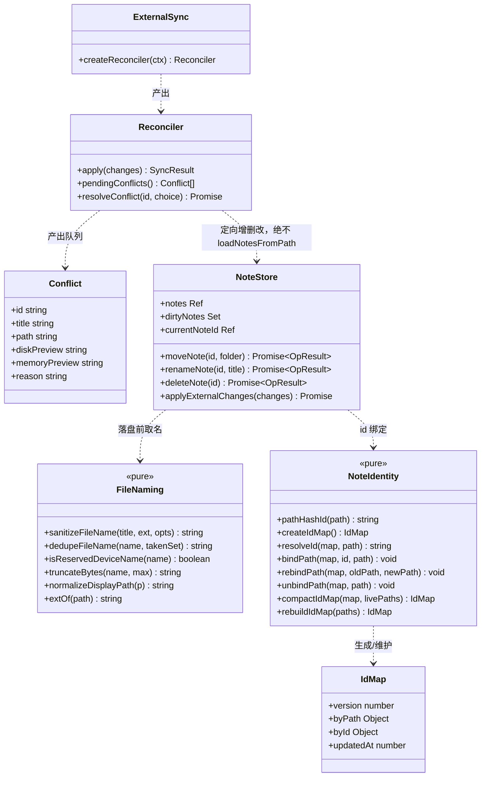

#### 关键接口签名

```js
// src/utils/fileNaming.js —— 零 import 纯函数
export function sanitizeFileName (title, ext, {
  taken = new Set(),        // 同目录已有文件名（不含扩展名比对时的完整名）
  maxBytes = 255
} = {}) => string
//   顺序：① 去控制字符 \u0000-\u001F ② 去 <>:"/\|?* ③ 去结尾空格与点
//        ④ Windows 保留设备名（CON/PRN/AUX/NUL/COM1-9/LPT1-9，含带扩展名形式）→ 前缀 '_'
//        ⑤ 按 UTF-8 字节截断到 maxBytes（不切断多字节字符）
//        ⑥ 空串回退 '无标题'

export function dedupeFileName (name, taken) => string   // 'a' → 'a 1' → 'a 2'（对标 Obsidian 空格+序号）
export function isReservedDeviceName (name) => boolean
export function normalizeDisplayPath (p) => string        // 统一分隔符（R-F9），仅用于展示/日志，不用于 fs

// src/utils/noteIdentity.js —— 零 import 纯函数
export const ID_MAP_VERSION = 1
export function pathHashId (path) => string              // 保留 note.js:24 的 djb2 语义，迁移期兜底
export function createIdMap () => IdMap
export function resolveId (map, path) => string          // byPath 命中 → 返回；否则 pathHashId(path)
export function bindPath (map, id, path) => void
export function rebindPath (map, oldPath, newPath) => void
export function unbindPath (map, path) => void
export function compactIdMap (map, livePaths) => IdMap   // 清理已失效路径
export function rebuildIdMap (paths) => IdMap            // 映射丢失时从磁盘路径全量重建

// src/composables/useExternalSync.js
export function createReconciler ({
  noteStore,          // 提供 notes / dirtyNotes / currentNoteId / readFile / upsert / remove
  readFile,           // (path) => Promise<string>
  log,                // logger 实例
  isNoteExtension     // (path) => boolean
}) => Reconciler

// reconcile 判定矩阵（写死，不得偏离）
//   变更类型 \ 内存状态      非 dirty          dirty 或 是 currentNote
//   add（新文件）            直接入库          直接入库
//   change（内容变化）       读盘 → 定向更新    入冲突队列，不改 content
//   unlink（删除）           从库移除          从库移除 + toast 告知
```

#### 程序调用流程：外部改 B 时正在编辑 A（R-F5 主验收场景）

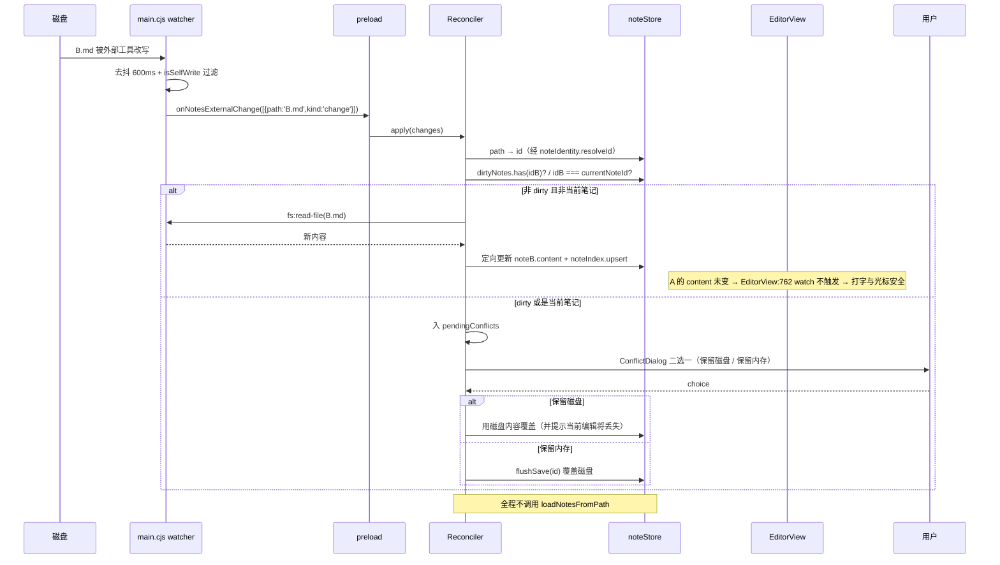

#### 新增 / 修改文件清单

| 路径 | 动作 | 负责什么 |
| --- | --- | --- |
| `src/utils/fileNaming.js` | 新增 | R-F2 合法化、R-F3 同名消解、R-F9 展示路径统一（纯函数） |
| `tests/fileNaming.test.js` | 新增 | `CON`/`NUL.md`/`AUX`/`LPT1`、结尾空格/点、控制字符、255 字节截断、重名 ` 1` |
| `src/utils/noteIdentity.js` | 新增 | R-F1 双轨 id：映射表维护 + 路径哈希兜底 + 重建 |
| `tests/noteIdentity.test.js` | 新增 | 迁移期老 id 可解析、移动后 id 不变、映射丢失可重建 |
| `src/composables/useExternalSync.js` | 新增 | R-F5 定向 reconcile + R-F6 冲突队列 |
| `tests/reconcile.test.js` | 新增 | 改 B 不动 A、dirty 时入冲突、unlink/add 处理 |
| `src/components/ConflictDialog.vue` | 新增 | R-F6 冲突二选一 UI（含磁盘/内存双预览） |
| `src/stores/note.js` | 修改 | 接入 fileNaming / noteIdentity；定向同步入口；不碰 loadNotesFromPath 的调用语义 |
| `electron/main.cjs` | 修改 | `fs:watch-notes` 去扩展名白名单（R-F7）；回调 payload 改变更清单；新增 `idmap:*` |
| `electron/preload.cjs` | 修改 | 桥接 `idmap:load/save`；`onNotesExternalChange` 回调签名带参 |
| `src/App.vue` | 修改 | `syncNotesWatch` 改接 Reconciler；删除 `loadNotesFromPath` 全量重载分支 |
| `src/constants/storage.js` | 修改 | `autoSync` fallback `false` → `true`（与 reconcile 同批） |
| `src/components/FolderNode.vue` | 修改 | R-S3 去 `window.prompt` |

---

### 3.2 模块二：文档管理系统（M2）

#### 数据结构

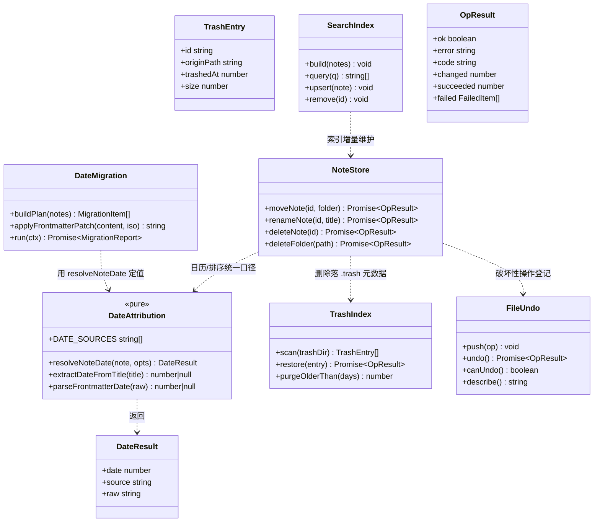

#### 关键接口签名

```js
// src/utils/dateAttribution.js —— 零 import 纯函数
export const DATE_SOURCES = ['frontmatter', 'birthtime', 'title', 'updatedAt']
export function resolveNoteDate (note, {
  birthtime = null,          // 主进程 stat 提供，浏览器环境为 null
  now = Date.now()
} = {}) => { date: number, source: string, raw: string|null }
//   四级回落（用户已拍板）：
//   ① frontmatter 显式 date:（兼容 created: / date: / created_at:）
//   ② 文件 birthtime（Linux 不可靠时由 ③ 兜）
//   ③ 标题中的日期串：2026-03-15 / 2026年3月15日 / 20260315
//   ④ updatedAt（现状行为，仅作最后兜底）

export function extractDateFromTitle (title) => number | null
export function parseFrontmatterDate (raw) => number | null

// 迁移（一次性）
// src/utils/dateMigration.js
export const DATE_MIGRATION_FLAG = 'choyeon-date-migration-v1'
export function buildPlan (notes) => Array<{ id, path, date, source }>
export function applyFrontmatterPatch (content, isoDate) => string   // 无 frontmatter 则插入；有则替换 date:
export async function run (ctx) => { patched, failed, skipped, report }

// 原子化（R-D2 / R-D3）
// moveNote / renameNote 一律改为 async，返回 OpResult
async function moveNote (noteId, targetFolder) => OpResult
async function renameNote (noteId, nextTitle) => OpResult
async function rewriteBacklinks (oldTitle, newTitle) =>
  { total: number, succeeded: number, failed: Array<{ id, path, error }> }
//   硬要求：内部 safeWriteFile 必须 await；调用方据此决定是否回滚

// OpResult（全项目统一）
// { ok:boolean, error?:string, code?:string, changed?:number, succeeded?:number, failed?:FailedItem[] }
// code 一律 kebab-case：target-exists / not-found / permission / path-outside / write-failed / timeout / conflict
```

#### 程序调用流程：R-D3 移动笔记（原子化后）

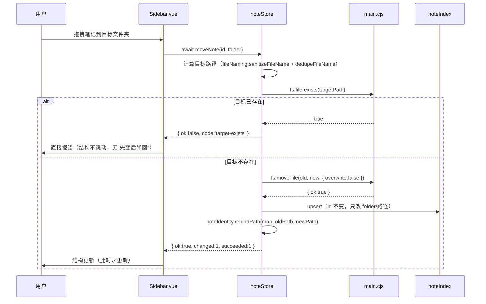

#### 新增 / 修改文件清单

| 路径 | 动作 | 负责什么 |
| --- | --- | --- |
| `src/utils/dateAttribution.js` | 新增 | R-D1 / R-C1 四级回落（纯函数） |
| `tests/dateAttribution.test.js` | 新增 | 四级优先级、标题日期串三种格式、frontmatter 兼容键 |
| `src/utils/dateMigration.js` | 新增 | 一次性固化进 frontmatter + flag 防重跑 |
| `src/utils/trashIndex.js` | 新增 | R-D5 最近删除扫描 / 还原 / 30 天清理 |
| `tests/trashIndex.test.js` | 新增 | 还原回原路径、30 天过期、系统回收站不可用降级 |
| `src/composables/useFileUndo.js` | 新增 | R-D7 文件级撤回栈（移动/重命名/删除） |
| `src/utils/searchIndex.js` | 新增 | R-D6 倒排检索（按 §2.6 实测口径投） |
| `src/views/TrashView.vue` | 新增 | R-D5 「最近删除」入口：来源路径 + 还原 |
| `src/stores/note.js` | 修改 | 原子化 move/rename/delete；rewriteBacklinks await；日期口径接入；undo 登记 |
| `src/utils/noteIndex.js` | 修改 | `dateKey` 改用 `resolveNoteDate()`（替换 171 行） |
| `src/components/Sidebar.vue` | 修改 | D-4 文案修正；D-3 异步适配；D-5 删除提示；D-7 撤回入口 |
| `src/views/CalendarView.vue` | 修改 | R-C1 日历归属（承接 D-1） |
| `electron/main.cjs` | 修改 | `fs:delete-file` 补 `.trash` 元数据；`trash:*` 通道 |
| `src/router/index.js` | 修改 | 新增 `/trash` 路由 |

---

### 3.3 模块三：设置功能（M3）

#### 数据结构与接口

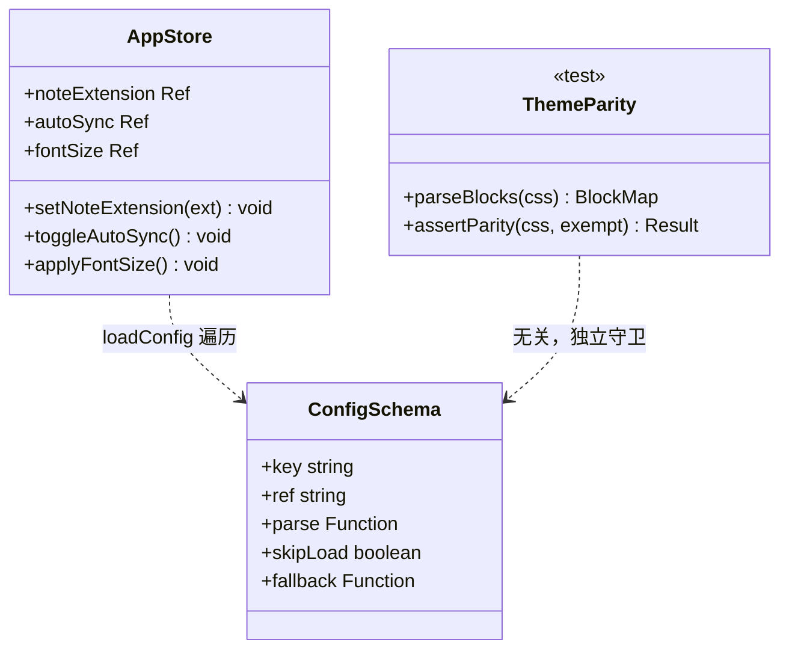

**R-S1（P0）根因与修复**：`src/constants/storage.js:129`
```js
{ key: LS_KEYS.noteExtension, ref: 'noteExtension', skipLoad: true, fallback: () => 'md' }
```
`loadConfig`（`app.js:245-270`）跳过所有 `skipLoad: true` → 新会话永远回到 `'md'`。
**修复**：删除 `skipLoad: true`，补 `parse: asString`（并校验值域 ∈ `NOTE_EXTENSIONS`，非法返回 `SKIP`）。
> 注意：`LS_KEYS.hotkeys`（`storage.js:139`）也是 `skipLoad: true`，但那是有意的（由 `mergeBindings` 单独处理），**不要一起改**。

**R-S3（P0）**：`FolderNode.vue:335` → 复用 `Sidebar.vue:351-367` 已有的 `askDialog`（`PromptDialog`）Promise 化用法。要求：自动聚焦、Enter/Esc 行为与 Sidebar 完全一致。

**R-S2（P1，按 §2.3 修正后的方向）**：见 §2.3 —— 补半透明子集 + 新增 `tests/themeParity.test.js` 守卫，而非「补齐 59 个变量」。

**R-S4（P1）**：`autoSync` 文案补说明「关闭时外部修改不会被感知」；默认值 `false → true`（与 reconcile 同批，T24）。

#### 新增 / 修改文件清单

| 路径 | 动作 | 负责什么 |
| --- | --- | --- |
| `src/constants/storage.js` | 修改 | R-S1 去掉 `skipLoad`；R-S4 `autoSync` fallback 改 `true` |
| `src/stores/app.js` | 修改 | R-S1 读取链路校验；R-S5 字号单一来源（批次 7） |
| `src/components/FolderNode.vue` | 修改 | R-S3 去 `window.prompt` |
| `src/style.css` | 修改 | R-S2 补 Electron dark 半透明子集；R-S5 收敛死代码字号（批次 7） |
| `tests/themeParity.test.js` | 新增 | R-S2 守卫：dark 变量两处同步 + 白名单 |
| `src/views/SettingsView.vue` | 修改 | R-S4 开关说明；R-L5 日志入口；R-S6 文案（批次 7） |

---

### 3.4 模块四：日志系统（M4，从零建立）

#### 数据结构

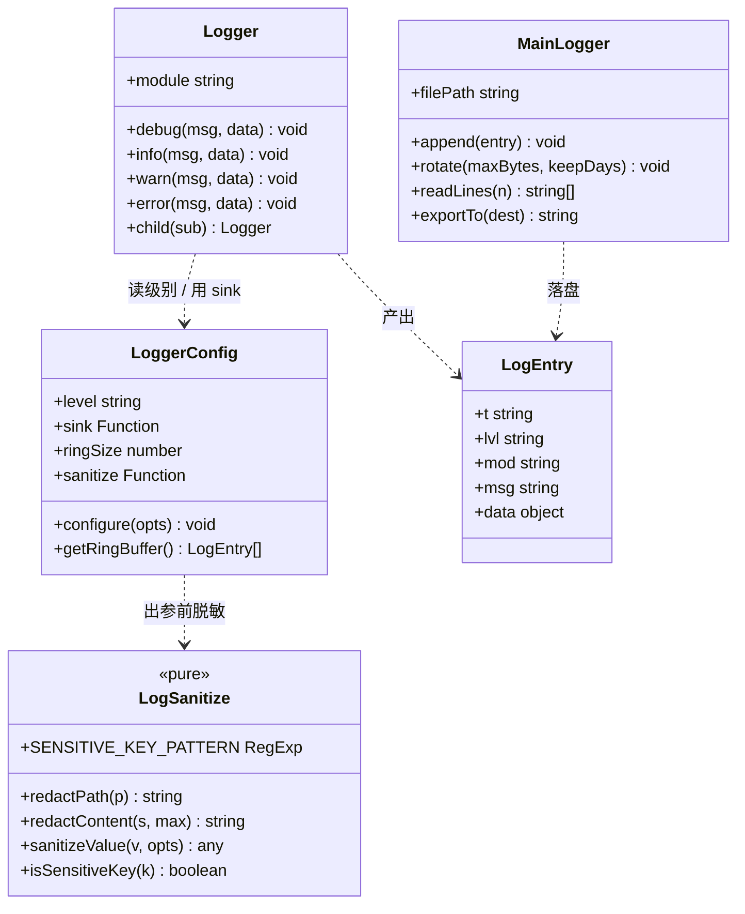

#### 关键接口签名

```js
// src/constants/logging.js
export const LOG_LEVELS = { debug: 10, info: 20, warn: 30, error: 40, silent: 100 }
export const DEFAULT_LOG_LEVEL = 'info'          // Q8 建议值，采纳
export const LOG_MAX_BYTES = 2 * 1024 * 1024     // 2MB 轮转
export const LOG_KEEP_DAYS = 7
export const LOG_RING_SIZE = 500                 // 渲染进程内存环形缓冲
export const LS_LOG_LEVEL = 'choyeon-log-level'

// src/utils/logger.js（约 200 行，含脱敏调用）
export function configureLogger ({ level, sink, sanitize } = {}) => void
export function createLogger (module) => Logger
export function getRingBuffer () => LogEntry[]
export function setLogLevel (level) => void

// 文本行格式（单一，主/渲染共用）：
// 2026-03-15T10:23:45.123Z  ERROR  [note]  删除文件失败  path=…/a.md code=write-failed
// 结构化（IPC 传输）：{ t, lvl, mod, msg, data }

// src/utils/logSanitize.js —— 零 import 纯函数
export const SENSITIVE_KEY_PATTERN = /(pass|passwd|password|secret|token|credential|apikey|api_key|private|value|valueenc)$/i
export function redactPath (p) => string     // 保留 basename，目录层替换为 '…/'；剥家目录
export function redactContent (s, max = 120) => string   // 截断 + 折叠换行
export function isSensitiveKey (k) => boolean
export function sanitizeValue (v, { maxDepth = 3, maxString = 200 } = {}) => any
```

**脱敏硬规则（L-6，写死）**：

1. 任何 key 命中 `SENSITIVE_KEY_PATTERN` → 值整体替换为 `'[REDACTED]'`，**不做首尾保留**（与 `vault.mask()` 的区别：mask 给 UI 用，日志必须整体遮蔽）。
2. 路径一律过 `redactPath()`：`/Users/alice/notes/a.md` → `…/notes/a.md`。**日志中不得出现未遮蔽的家目录路径**。
3. 笔记内容片段：进入 `data` 前先 `redactContent(s, 120)`。
4. **vault 模块专属**（§2.2）：`entry.value` / `entry.valueEnc` 永不入日志；`secret === true` 时 `entry.key` / `entry.note` 一并脱敏。`vaultEncrypt` / `vaultDecrypt` 的输入输出整条禁记。

#### 程序调用流程：一次跨 IPC 失败在同一份日志里串起来（R-L3）

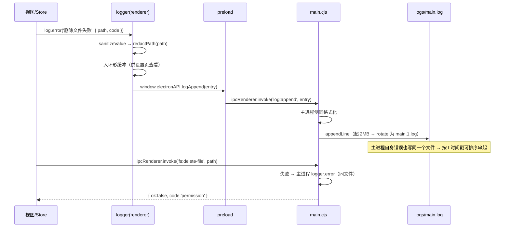

#### 新增 / 修改文件清单

| 路径 | 动作 | 负责什么 |
| --- | --- | --- |
| `src/constants/logging.js` | 新增 | 级别 / 轮转 / 保留常量 + localStorage key |
| `src/utils/logger.js` | 新增 | 统一抽象（约 200 行）：分级、模块、环形缓冲、sink |
| `src/utils/logSanitize.js` | 新增 | 脱敏规则（纯函数） |
| `tests/logger.test.js` | 新增 | 级别过滤、模块标签、格式、轮转 |
| `tests/logSanitize.test.js` | 新增 | 家目录遮蔽、敏感 key、内容截断、vault 字段 |
| `src/views/settings/SettingsLogs.vue` | 新增 | R-L5 查看 / 导出 / 级别切换 |
| `electron/main.cjs` | 修改 | `log:*` IPC + 落盘轮转 + 主进程 23 处 console 迁移 |
| `electron/preload.cjs` | 修改 | 桥接 `log:*` |
| `src/stores/note.js` / `vault.js` / `app.js` | 修改 | console → logger（含 vault 静默 catch 补记） |
| `src/App.vue` + `useAppActions.js` + `useCommands.js` | 修改 | console → logger |
| `src/views/SettingsView.vue` / `WelcomeView.vue` / `CommandPalette.vue` | 修改 | console → logger |
| `src/utils/shortcutAudit.js` / `markdown.js` | 修改 | console → logger |

---

### 3.5 模块五：日历（M5）

#### 数据结构与接口

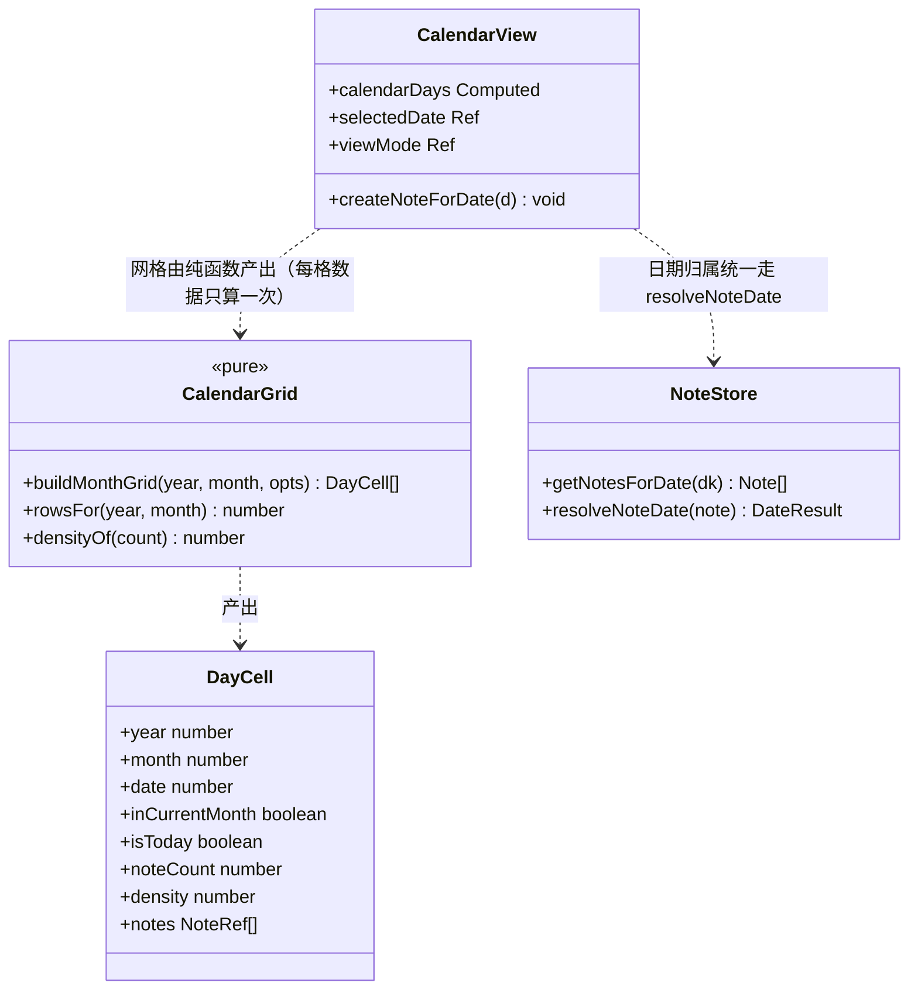

```js
// src/utils/calendarGrid.js —— 零 import 纯函数
export function buildMonthGrid (year, month, {
  weekStartsOn = 1,        // 周一
  countsByDateKey = {},    // { '2026-3-15': 5 }
  notesByDateKey = {}
} = {}) => DayCell[]
//   R-C2：行数随月份浮动（5 或 6 行），非本月格子带 inCurrentMonth:false 供视觉区分
//   R-C3：density = 0..4 由 noteCount 分档，替代纯 +N
//   R-C4：countsByDateKey 一次构建，42 格不再逐格全库扫描（每格数据只算一次）

export function rowsFor (year, month) => number
export function densityOf (count) => number      // 0 / 1 / 2 / 3 / 4
```

> **R-C4 说明**：按 §2.6 实测，N=2000 下 42 格全扫仅 8.44ms，**PM 的 `<100ms` 目标现状已达标**。因此 R-C4 **不单独立项**，去重合并进 T37。

#### 新增 / 修改文件清单

| 路径 | 动作 | 负责什么 |
| --- | --- | --- |
| `src/utils/calendarGrid.js` | 新增 | R-C2 网格行数浮动 + R-C3 密度分档（纯函数） |
| `src/views/CalendarView.vue` | 修改 | 消费 calendarGrid；每格只算一次；周/议程视图（R-C5）；日记可配置（R-C6，批次 7） |

---

### 3.6 模块六：关系图（M6）

#### 数据结构与接口

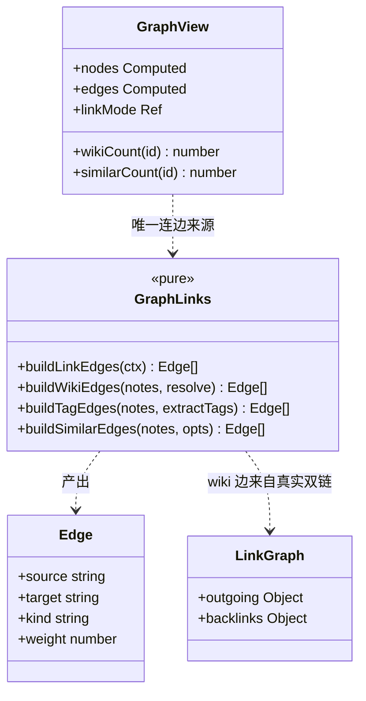

```js
// src/utils/graphLinks.js —— 零 import 纯函数
export const EDGE_KINDS = { wiki: 'wiki', tag: 'tag', similar: 'similar' }
export const EDGE_WEIGHT = { wiki: 3, tag: 2, similar: 0.5 }   // 双链权重最高（Q7：降权保留）

export function buildWikiEdges (notes, { resolveTarget, idOfTitle }) => Edge[]
export function buildTagEdges (notes, extractTags) => Edge[]    // ★ 必须复用 useLinks 的 TAG_REGEX（R-G2）
export function buildSimilarEdges (notes, { extractTitleKeywords, extractContentKeywords }) => Edge[]
export function buildLinkEdges ({ notes, resolveTarget, idOfTitle, extractTags, linkMode = 'all' }) => Edge[]
//   linkMode: 'all'（默认，含降权相似度边） | 'wiki-only'（R-G1「仅双链」开关）
```

**R-G2 硬要求**：`GraphView.vue:462` 的本地 `tagRegex = /#(\S+?)(?=\s|#|$)/g` **必须删除**，改用 `useLinks.js:258` 的 `TAG_REGEX = /(^|\s)#([A-Za-z0-9_\u4e00-\u9fa5-]+)/g`。测试锁定两处一致。

**R-G5 硬要求**：`getLinkCount`（`GraphView.vue:873-879`）拆成 `wikiCount(id)` 与 `similarCount(id)`，**分列展示**，禁止混标。

**R-G3**：布局种子改为确定性（去掉 `GraphView.vue:561` 的 `Math.random()`），节点坐标持久化到 localStorage（`choyeon-graph-positions`），提供「重新布局」动作。

**R-G4**：重建指纹 `GraphView.vue:978-987`（`id:title:content.length`）补 `folder` 与内容实质变化（用 `content.length + content.slice(0,64)` 或轻量哈希）。

#### 新增 / 修改文件清单

| 路径 | 动作 | 负责什么 |
| --- | --- | --- |
| `src/utils/graphLinks.js` | 新增 | R-G1 双链一等边 + tag 口径统一 + 相似度降权（纯函数） |
| `tests/graphLinks.test.js` | 新增 | `[[B]]` 必连线；`#define` / URL `#anchor` 不被识别为 tag |
| `src/views/GraphView.vue` | 修改 | 接入 graphLinks；拆指标；布局持久化；指纹补全；搜索支持 tag（R-G6，批次 7） |
| `src/stores/app.js` | 修改 | 图布局坐标持久化 + `linkMode` 设置项 |

---

## 4. 共享知识（跨文件必须一致）

### 4.1 命名

- **模块目录**：纯内核一律 `src/utils/<domain>.js`；需要响应式/生命周期的接线一律 `src/composables/use<X>.js`。
- **新文件命名**沿用现有风格：小写 + 点分（`noteIdentity.js` / `logSanitize.js`），**不引入 `kebab-case.js`**（现有仓库是 camelCase）。
- **测试**：`tests/<domain>.test.js`，`describe('<模块/能力>')`。

### 4.2 IPC 通道名（沿用现有 `<domain>:<action>` 冒号 + 连字符风格）

| 通道 | 方向 | 用途 |
| --- | --- | --- |
| `idmap:load` / `idmap:save` | invoke | 稳定 id 映射表读写（`userData/note-id-map.json`） |
| `log:append` | invoke | 渲染进程 → 主进程 落盘 |
| `log:read` | invoke | 读取最近 N 行（设置页查看） |
| `log:path` | invoke | 日志文件绝对路径（导出用） |
| `log:export` | invoke | 导出为单个可分享文件 |
| `log:clear` | invoke | 清空日志 |
| `log:set-level` | invoke | 运行时切换级别 |
| `trash:list` / `trash:restore` / `trash:purge` | invoke | 库内 `.trash` 管理 |
| `fs:watch-notes` | invoke | **行为变更**：不再只认 `.md/.markdown/.txt`，改为整目录监听 |
| `onNotesExternalChange` | event | **签名变更**：回调参数从 `()` 改为 `(changes: Array<{path, kind}>)`，`kind ∈ 'add' \| 'change' \| 'unlink'` |

> 现有 `fs:*` / `app:*` / `workspace:*` / `vault:*` / `spell:*` / `updater:*` / `bing:*` 一律不动。

### 4.3 localStorage 键名（全部登记进 `src/constants/storage.js` 的 `LS_KEYS`）

| key | 用途 | 备注 |
| --- | --- | --- |
| `choyeon-note-id-map` | id 映射表（**浏览器降级**；Electron 走 `userData`） | 新增 |
| `choyeon-date-migration-v1` | 日期一次性迁移标记，防重跑 | 新增，值为迁移完成时间戳 |
| `choyeon-log-level` | 日志级别 | 新增 |
| `choyeon-graph-positions` | 关系图节点坐标 | 新增 |
| `choyeon-auto-sync` | 已有；本轮只改 fallback | 字符串值**禁止修改** |
| `choyeon-note-extension` | 已有；本轮去掉 `skipLoad` | 字符串值**禁止修改** |

> `LS_KEYS` 的字符串值必须与历史版本逐字一致（见 `storage.js` 头部约定）。

### 4.4 日志格式（单一，主/渲染共用）

```
<ISO8601 毫秒>  <LEVEL 5 字符左对齐>  [<module>]  <message>  <k=v k=v …>
2026-03-15T10:23:45.123Z  ERROR  [note]  删除文件失败  path=…/a.md code=permission
```

- 结构化传输：`{ t, lvl, mod, msg, data }`
- 级别：`debug < info < warn < error < silent`；默认 `info`（Q8 建议值，采纳）
- 轮转：单文件 2MB → `main.1.log`…保留 7 天
- **模块名约定**：`note` / `app` / `vault` / `workspace` / `watcher` / `ipc` / `graph` / `calendar` / `editor` / `sync`

### 4.5 错误码口径

- 一律 **kebab-case**：`target-exists` / `not-found` / `permission` / `path-outside` / `write-failed` / `timeout` / `conflict`
- 存量 `fs:move-file` 已返回的 `'target-exists'`（PM 证据 `main.cjs:914-951`）**保留兼容**，不改名
- 所有 `OpResult` 必须带 `code`；UI 文案按 `code` 映射中文，**不得直接把英文码显示给用户**

### 4.6 测试约定

- jsdom 环境已由 `vite.config.js` 配好；**无 setup 文件** → 需要 `window.electronAPI` 的用例**自行在 `beforeEach` 里 mock，`afterEach` 还原**。
- 纯内核测试**不得 import 任何 vue / pinia / store**（保证毫秒级、零副作用）。
- `tests/themeParity.test.js` 直接 `fs.readFileSync('src/style.css')` 解析，不启动 DOM。

### 4.7 并行纪律（本轮最高优先级约定）

1. **同一文件在任何时候只能被一个任务拥有** —— 本设计每个文件在任一批次内只出现在一个任务的 `owns` 里；跨批次由批次串行闸门保证交接。
2. 瓶颈文件（`src/stores/note.js`、`electron/main.cjs`、`src/components/Sidebar.vue`、`src/views/SettingsView.vue`、`src/views/CalendarView.vue`、`src/views/GraphView.vue`、`src/style.css`）在**同一批次内只允许一个任务持有**；若同批两个任务都需要，必须**改为批内串行依赖**（如 T02 → T03）。
3. **CSS 变量改一处必须同时想四处**：`:root`、`[data-theme='dark']`、`.electron-mode`、`.electron-mode[data-theme='dark']`。`@media (prefers-color-scheme: dark)` **不存在**（实测 0 命中），不要去找它。
4. **改 lucide 图标后必须真跑一次 build**（`MISSING_EXPORT` 只在打包期报）；`lucide-vue-next@0.298` 里 `LockOpen` 不存在，用 `Unlock`。
5. **源码禁止裸 NUL 字节**（当前实测 0 文件含裸 NUL，保持）；`vault.js` 的 `\u0000` 必须保持转义写法。
6. **Electron 起不来**（GPU fatal）→ 运行时验证一律走浏览器 CDP（`node tmp/smoke.mjs`）；并行任务各自 `--outDir tmp/distcheck-<任务号>`，**只有冒烟用 `tmp/distcheck`**，全部加 `--emptyOutDir=false`。
7. **Bash 可能不可用** → 换 PowerShell；`npm`/`npx` 用 `npm.cmd`/`npx.cmd`；PowerShell 不回显 stdout → `Out-File -Encoding utf8` 落文件再 Read；命令开头加 `[Console]::OutputEncoding = [System.Text.Encoding]::UTF8`。

---

## 5. 依赖包

**结论：不新增任何第三方依赖。确认 PM 的 Q9 建议（手写约 200 行，不引 `electron-log` 一类）。**

| 需求 | 结论 | 理由 |
| --- | --- | --- |
| R-L1~L3 日志 | **手写** | 只需要「分级 + 模块 + sink + 环形缓冲 + 轮转」，约 200 行。`electron-log` 会带来打包体积、IPC 面与供应链安全面扩大，且它的渲染/主进程分离模型与本项目的 `contextBridge` 白名单约束需要额外适配 |
| R-F2 文件名合法化 | **手写** | 规则集约 40 行，无成熟库只做这一件事 |
| R-D6 搜索索引 | **手写**（倒排表 + 增量维护） | 引入 `flexsearch`/`minisearch` 会新增体积且与 `noteIndex` 双份索引；且按 §2.6 实测，**是否真的需要索引取决于语料规模**，先落基准再定 |
| R-G1 图边 | **手写** | 复用已有 `useLinks` / `noteIndex` |
| 轮转 / 日期解析 / 网格 | **手写** | 均属纯函数 |

**若后续语料实测（≥10MB）确认需要更强检索**，再单独评估引入 `minisearch`（约 30KB）—— 但那是 R-D6 立项之后的事，不进本轮。

---

## 6. 任务分解

> **并行硬约束**：同批次内并行任务的 `owns` 必须完全不重叠（上一轮因并行编辑同一文件静默丢失 4 处改动，症状是 build 通过但运行时 `ReferenceError`）。
> **批次是串行闸门**：上一批验收未过，不得开始下一批。
> **每批结尾给出验收口径**。

### 批次 1 · 数据安全止血（P0）—— R-F2 R-F3 R-D2 R-D3 R-D4 R-S1 R-S3

| 编号 | 任务 | `owns` | 依赖 | 验收 |
| --- | --- | --- | --- | --- |
| **T01** | 文件名合法化纯内核 | `src/utils/fileNaming.js`（新）、`tests/fileNaming.test.js`（新） | — | ① `CON`/`NUL.md`/`AUX`/`LPT1` 四类保留名均落盘为合法名且不指向系统设备；② 结尾空格/点被剥除；③ 控制字符清除 + 255 字节 UTF-8 安全截断；④ 同目录重名自动 ` 1` / ` 2`；⑤ 纯函数零 import |
| **T02** | note.js 命名接入 + 同名消解 | `src/stores/note.js` | T01 | ① `safeFileName`（`note.js:335-337`）改调 `fileNaming.sanitizeFileName`；② `saveNoteToFile`（`note.js:1114-1140`）写入前做目标冲突检测；③ 同一目录连续新建 3 篇同名笔记得到 3 个文件，零覆盖 |
| **T03** | note.js 移动/重命名原子化 | `src/stores/note.js` | T02 | ① `moveNote`（`note.js:339-381`）/`renameNote`（`424-478`）改 `async`，不再无条件 `return true`；② `rewriteBacklinks`（`388-412`）内部 `safeWriteFile` 全部 `await`，返回 `{ total, succeeded, failed }`；③ 失败时不改动内存结构（无「先变后弹回」） |
| **T04** | 默认扩展名持久化 | `src/constants/storage.js`、`src/stores/app.js` | — | ① `storage.js:129` 去掉 `skipLoad: true` 并补 `parse`；② 设为 `.txt` → 重启 → 新建扩展名仍为 `.txt`；③ `hotkeys`（`storage.js:139`）的 `skipLoad` **不得一起改** |
| **T05** | 文件树去 `window.prompt` | `src/components/FolderNode.vue` | — | ① 第 335 行改用 `PromptDialog`；② 自动聚焦、Enter/Esc 与 `Sidebar.vue:351-367` 的 `askDialog` 完全一致；③ 全项目 `grep window.prompt src/` 真实调用数 = 0 |
| **T06** | 侧边栏删除文案 + 异步适配 | `src/components/Sidebar.vue` | T03 | ① `Sidebar.vue:590-596` 文案改为「笔记会随目录一起被删除（可找回）」，与 `deleteFolder`（`note.js:498-545`）真实行为逐条对应；② 移动/重命名改 `await` 并按 `OpResult.code` 提示；③ 删除失败降级（笔记回根目录）有明确告知 |
| **T07** | 文件操作回归测试 | `tests/noteFileOps.test.js`（新） | T01、T02、T03 | ① 覆盖 R-F2/R-F3/R-D2/R-D3 全部验收点；② mock `window.electronAPI` 并注入写盘失败，断言有明确报错而非静默孤儿 |

**批次 1 验收口径**：
```
npm.cmd test            → 8 files + 新增 3 files，全绿，0 failed（基线 174 → ≥174+新增）
npx.cmd vite build --outDir tmp/distcheck-b1 --emptyOutDir=false   → 通过
node tmp/smoke.mjs      → ERRORS(0)
grep -rn "window.prompt" src/   → 仅剩注释命中，真实调用 0
```

---

### 批次 2 · 日志系统 P0 —— R-L1 R-L2 R-L3

| 编号 | 任务 | `owns` | 依赖 | 验收 |
| --- | --- | --- | --- | --- |
| **T08** | 日志内核 + 脱敏 | `src/constants/logging.js`（新）、`src/utils/logger.js`（新）、`src/utils/logSanitize.js`（新） | — | ① `createLogger(module)` 产出 debug/info/warn/error；② 级别可运行时切换；③ 环形缓冲 500 条；④ 脱敏：家目录遮蔽、敏感 key 整体 `[REDACTED]`、内容截断 120；⑤ 纯内核零 import |
| **T09** | 主进程落盘 + IPC 桥接 | `electron/main.cjs`、`electron/preload.cjs` | T08 | ① `log:append/read/path/export/clear/set-level` 六个通道；② 落盘 `userData/logs/main.log`，2MB 轮转、7 天保留；③ 主进程 23 处 `console.*` 全量迁移；④ 主/渲染记录在同一文件按时间戳可排序 |
| **T10** | console 迁移：stores | `src/stores/note.js`、`src/stores/vault.js`、`src/stores/app.js` | T08 | ① 15 处 console 迁移；② **vault.js 的静默 catch（`vault.js:252-256`）补记日志**；③ vault 明文/密文永不入日志 |
| **T11** | console 迁移：App + composables | `src/App.vue`、`src/composables/useAppActions.js`、`src/composables/useCommands.js` | T08 | ① 11 处 console 迁移；② 日志模块名分别为 `app` / `actions` / `commands` |
| **T12** | console 迁移：views | `src/views/SettingsView.vue`、`src/views/WelcomeView.vue`、`src/components/CommandPalette.vue` | T08 | ① 5 处 console 迁移；② 不破坏 `CommandPalette` 现有测试（24 例） |
| **T13** | console 迁移：utils | `src/utils/shortcutAudit.js`、`src/utils/markdown.js` | T08 | ① 2 处 console 迁移；② 不破坏 `shortcuts.test.js` 41 例 |
| **T14** | 日志单测 | `tests/logger.test.js`（新）、`tests/logSanitize.test.js`（新） | T08 | ① 级别过滤（只输出 error+）；② 模块过滤；③ 格式含时间/级别/模块；④ 家目录不出现在输出中；⑤ vault 敏感字段被遮蔽 |

**批次 2 验收口径**：
```
npm.cmd test            → 全绿（新增 2 个测试文件）
node tmp/smoke.mjs      → ERRORS(0)
grep -rn "console.error\|console.warn" src/   → 0 命中（面向诊断的裸调用已全部迁移）
运行后 userData/logs/ 下出现 main.log（浏览器环境退化为环形缓冲 + dev 控制台，不报错）
```

---

### 批次 3 · 标识与时间语义（P0，风险最高）—— R-F1 R-D1 R-C1

| 编号 | 任务 | `owns` | 依赖 | 验收 |
| --- | --- | --- | --- | --- |
| **T15** | 稳定 id 内核 | `src/utils/noteIdentity.js`（新）、`tests/noteIdentity.test.js`（新） | — | ① `resolveId` 命中映射表→返回；未命中→`pathHashId`（**保证老 id 可解析**）；② 移动/重命名后 id 不变；③ `rebuildIdMap(paths)` 可从磁盘路径全量重建；④ 纯函数零 import |
| **T16** | id 映射落盘 | `electron/main.cjs`、`electron/preload.cjs` | T15 | ① `idmap:load` / `idmap:save`，文件 `userData/note-id-map.json`；② 浏览器降级写 `choyeon-note-id-map`；③ **绝不写用户的 .md 文件**（测试断言：迁移后 .md 字节不变） |
| **T17** | 日期归属四级回落 | `src/utils/dateAttribution.js`（新）、`tests/dateAttribution.test.js`（新） | — | ① frontmatter `date:` → `birthtime` → 标题日期串 → `updatedAt`；② 标题串支持 `2026-03-15` / `2026年3月15日` / `20260315`；③ 返回 `{ date, source }` 供迁移与 UI 显示来源 |
| **T18** | 索引日期键 + 一次性迁移 | `src/utils/noteIndex.js`、`src/utils/dateMigration.js`（新） | T17 | ① `noteIndex.js:171` 的 `dateKeyOf(note.updatedAt)` 改为 `resolveNoteDate()`；② 迁移把现值固化进 frontmatter `date:`；③ flag `choyeon-date-migration-v1` 防重跑；④ 迁移前后日期分布不漂移 |
| **T19** | note.js 接入 id + 日期 | `src/stores/note.js` | T15、T16、T17、T18 | ① `note.js:1052` 的 `generateStableId(file.path)` 改为「映射表优先 + 哈希兜底」；② 移动/重命名后 `rebindPath`；③ 排序与日历统一走 `resolveNoteDate()` |
| **T20** | 迁移验证脚本 | `tmp/migration-check.mjs`（新） | T19 | ① 输出迁移前后：笔记总数、日期分布直方图、id 解析成功率；② 笔记数不变、内容不变；③ 旧书签 id 仍能打开未移动过的笔记 |

**批次 3 验收口径**：
```
npm.cmd test            → 全绿
node tmp/migration-check.mjs  → 笔记数一致、日期分布无大规模漂移、老 id 解析成功率 100%
npx.cmd vite build --outDir tmp/distcheck-b3 --emptyOutDir=false  → 通过
node tmp/smoke.mjs      → ERRORS(0)
```

---

### 批次 4 · 磁盘变更感知（四项不可拆）—— R-F4 R-F5 R-F6 R-S4 R-F7

| 编号 | 任务 | `owns` | 依赖 | 验收 |
| --- | --- | --- | --- | --- |
| **T21** | 主进程监听改造 | `electron/main.cjs`、`electron/preload.cjs` | T19 | ① 去掉 `main.cjs:704` 的扩展名白名单（R-F7），改整目录监听；② 回调 payload 从无参改为 `changes: [{ path, kind }]`，`kind ∈ add/change/unlink`；③ 保留 600ms 去抖与 `isSelfWrite` 过滤 |
| **T22** | reconcile 内核 | `src/composables/useExternalSync.js`（新）、`tests/reconcile.test.js`（新） | T21 | ① **不调用 `loadNotesFromPath`**；② 正在编辑 A 时外部改 B → A 的 `content` 字段不被改动（硬口径，见 §2.1）；③ `dirtyNotes.has(id)` 或 `id === currentNoteId` → 入冲突队列；④ 非笔记文件变更只更新信号，不触发整库重载 |
| **T23** | 冲突提示 UI | `src/components/ConflictDialog.vue`（新） | T22 | ① 展示磁盘版 / 内存版双预览；② 用户二选一后结果与所选一致；③ 未选中一方不产生多余孤儿文件；④ Esc 默认视为「保留内存」并提示 |
| **T24** | App.vue 接线 + 默认值翻转 | `src/App.vue`、`src/constants/storage.js` | T21、T22、T23 | ① `App.vue:236-238` 的全量重载分支删除，改接 Reconciler；② `storage.js:128` `autoSync` fallback `false → true`（**与 reconcile 同一任务，不可拆**）；③ 默认配置下外部改 `.md` 2s 内被感知且不破坏正在编辑的内容 |
| **T25** | 设置页开关自解释 | `src/views/SettingsView.vue` | T24 | ① 开关下方说明「关闭时外部修改不会被感知」；② 设置为关闭时不产生任何隐蔽的数据覆盖 |

**批次 4 验收口径**（本批是用户拍板决策 3 的落点，必须整批一次性交付）：
```
npm.cmd test            → 全绿（新增 reconcile.test.js）
人工/脚本场景 1：编辑 A 时外部改 B → A 内容不丢、光标不跳、列表不闪烁
人工/脚本场景 2：同一文件「外部改 + 应用内改」→ 必须出现二选一提示
grep autoSync src/constants/storage.js  → fallback () => true
node tmp/smoke.mjs      → ERRORS(0)
```

---

### 批次 5 · 可恢复性 + 多库 + 检索 + 日志入口 —— R-D5 R-D7 R-D6 R-F8 R-L5 R-C4

| 编号 | 任务 | `owns` | 依赖 | 验收 |
| --- | --- | --- | --- | --- |
| **T26** | 最近删除索引 | `src/utils/trashIndex.js`（新）、`tests/trashIndex.test.js`（新） | — | ① 扫描库内 `.trash`，产出 `{ originPath, trashedAt, size }`；② 还原回原文件夹且内容一致；③ 30 天过期清理 |
| **T27** | 主进程回收站元数据 | `electron/main.cjs` | T26 | ① `fs:delete-file`（`main.cjs:858-879`）优先 `shell.trashItem`，失败退化为库内 `.trash` 并**写入来源路径元数据**；② 新增 `trash:list/restore/purge`；③ 系统回收站不可用时有清晰说明 |
| **T28** | 最近删除视图 + 路由 | `src/views/TrashView.vue`（新）、`src/router/index.js` | T26、T27 | ① 应用内能看到最近删除并显示来源路径；② 一键还原；③ 彻底删除二次确认 |
| **T29** | 文件操作撤回 | `src/composables/useFileUndo.js`（新）、`src/stores/note.js` | T19 | ① 移动/重命名/删除登记撤回栈；② 误删文件夹一步回到原位置且笔记数不变；③ 撤跨越 UI 操作（含中途切页面）仍有效 |
| **T30** | 搜索索引（先落基准） | `tmp/bench-search.mjs`（新）、`src/utils/searchIndex.js`（新）、`src/stores/note.js` | T29 | ① **先用 `tmp/bench-search.mjs` 实测 2000 篇 × 5KB**；② 仅在实测超 16ms 时投入倒排索引；③ 改造前后对同一 query 结果集逐条一致（不得因走索引漏召回） |
| **T31** | 多库管理入口 | `src/components/WorkspaceManager.vue`（新）、`src/stores/workspace.js` | — | ① 新增 / 切换 / 重命名 / 移除；② 显示存在 / 缺失状态；③ 移除某库不影响磁盘文件；④ 磁盘上库被删时 UI 显示缺失而非崩溃 |
| **T32** | 日志查看 / 导出入口 | `src/views/settings/SettingsLogs.vue`（新）、`src/views/SettingsView.vue` | T08 | ① 设置页可见「查看日志 / 导出日志」；② 导出得到单个可分享文件；③ 导出不阻塞 UI；④ 级别可切换 |
| **T33** | 日历归属与去重 | `src/views/CalendarView.vue` | T18 | ① 消费 `resolveNoteDate()`；② 每格数据只算一次（合并 R-C4 的去重，不单独立项）；③ 每分钟今日刷新不再重算整个日历 |

**批次 5 验收口径**：
```
npm.cmd test                 → 全绿（新增 trashIndex.test.js）
node tmp/bench-search.mjs    → 输出 2000×5KB 实测值（作为 R-D6 是否投索引的判据）
node tmp/smoke.mjs           → ERRORS(0)
人工：删除 → 最近删除可见 → 还原 → 回到原文件夹且内容一致
```

---

### 批次 6 · 视图质量 —— R-G1 R-G2 R-G3 R-G4 R-G5 R-S2 R-C2 R-C3 R-C5

| 编号 | 任务 | `owns` | 依赖 | 验收 |
| --- | --- | --- | --- | --- |
| **T34** | 双链进图内核 | `src/utils/graphLinks.js`（新）、`tests/graphLinks.test.js`（新） | T19 | ① `[[B]]` 必连线，weight 3；② tag 边复用 `useLinks.js:258` 的 `TAG_REGEX`（`#define` / URL `#anchor` 不再被识别）；③ 相似度边 weight 0.5；④ `linkMode: 'all' \| 'wiki-only'` |
| **T35** | GraphView 接入双链 + 指标修正 | `src/views/GraphView.vue` | T34 | ① 删除 `GraphView.vue:462` 本地 tagRegex；② `getLinkCount`（`873-879`）拆为 `wikiCount` / `similarCount` 分列展示；③ 手写 12 条 `[[ ]]` 的笔记显示链接数 = 12 |
| **T36** | 图谱布局持久化 + 设置项 | `src/views/GraphView.vue`、`src/stores/app.js` | T35 | ① 去掉 `GraphView.vue:561` 的 `Math.random()` 初值；② 坐标持久化到 `choyeon-graph-positions`；③ 冷启动两次排布一致；④ 提供「重新布局」动作；⑤ 指纹补 `folder` 与内容实质变化 |
| **T37** | 日历网格 + 密度 | `src/utils/calendarGrid.js`（新）、`src/views/CalendarView.vue` | T33 | ① 平年 2 月首日周一时不出现超过一行的下个月；② 非本月与本月视觉可区分；③ 单日 ≥3 篇有密度信号而非纯 `+N` |
| **T38** | 周 / 议程视图 | `src/views/CalendarView.vue` | T37 | ① 能看到连续一周的笔记分布；② 与月视图切换不丢失当前选中日期 |
| **T39** | Electron 深色变量守卫 | `src/style.css`、`tests/themeParity.test.js`（新） | — | ① 为 §2.3 差集中的**视觉敏感子集**（surface / glass / shadow / 文本，约 20 个）补 `.electron-mode[data-theme='dark']` 的**半透明版**；② 纯色相类（primary / state / accent）登记进 `ELECTRON_DARK_EXEMPT` 白名单；③ `tests/themeParity.test.js` 断言：dark 变量要么两侧都有、要么在白名单 |

**批次 6 验收口径**：
```
npm.cmd test            → 全绿（新增 graphLinks.test.js / themeParity.test.js）
npx.cmd vite build      → 通过（★ 改了 lucide / style.css 必须真跑打包，MISSING_EXPORT 只在打包期报）
node tmp/smoke.mjs      → ERRORS(0)
人工：桌面端深色模式无「实色板」质感断层；关系图双链边可见且可切「仅双链」
```

---

### 批次 7 · P2 收尾（**建议本轮不派工，推迟到下一轮**）

| 编号 | 任务 | `owns` | 依赖 | 说明 |
| --- | --- | --- | --- | --- |
| T40 | 列表真实扩展名 + 去假复选框 | `src/views/NotesListView.vue` | — | R-D9 / R-D10 |
| T41 | 字号定义收敛到单一来源 | `src/style.css`、`src/stores/app.js` | T39 | R-S5（删 `style.css:183-219` 死代码） |
| T42 | 设置项说明文案 | `src/views/SettingsView.vue` | T32 | R-S6 |
| T43 | 路径展示统一 | `src/utils/fileNaming.js`、`src/stores/note.js` | T30 | R-F9 |

> **建议整批推迟**：R-D8（图片/附件，D-8 是**新能力不是修 bug**，需 renderer.image + 粘贴 + 拖入 + 跟随移动删除，应单独立项）、R-C6（日记模板三件套）、R-G6（图谱搜索 tag）、R-L7（复制诊断信息）四项**本轮不做**。

---

### 依赖总图

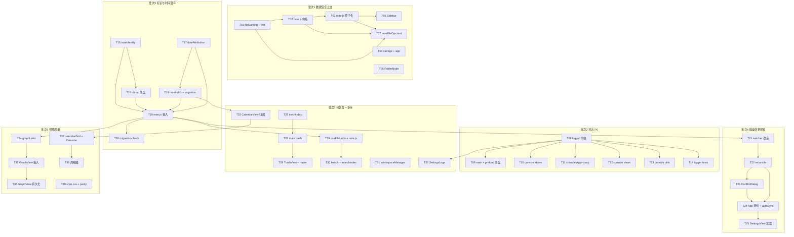

### 并行建议（给派工用）

| 批次 | 可全并行 | 需串行 |
| --- | --- | --- |
| 1 | T01 / T04 / T05 三路首发；T02 需 T01 | T02 → T03 → T06 / T07 |
| 2 | T09 / T10 / T11 / T12 / T13 五路并行（文件零重叠） | T08 必须先完成 |
| 3 | T15 / T17 并行首发；T16 需 T15；T18 需 T17 | 全部收敛到 T19（note.js 独占）→ T20 |
| 4 | T22 / T23 可与 T21 部分重叠（T22 需 T21 接口定义） | T21 → T22 → T23 → T24 → T25 建议串行，本批是不可拆整体 |
| 5 | T26 / T31 / T32 三路首发；T27 需 T26 | T29 → T30（note.js 批内串行） |
| 6 | T34 / T37 / T39 三路并行首发 | T35 → T36；T37 → T38 |

**建议第一批派工（批次 1 首发 4 个任务，文件零重叠）**：
**T01**（fileNaming 纯内核）、**T04**（storage+app 扩展名持久化）、**T05**（FolderNode 去 prompt）、**T02**（note.js 命名接入，需 T01 完成后启动）。
第二批紧接着：T03 → T06 / T07。

---

## 7. 待明确事项

### 7.1 建议回退给 PM 修正（P0 描述与实际代码不符）

| # | 事项 | 我的实测结论 | 建议 |
| --- | --- | --- | --- |
| **A-1** | **S-2 机理错误**（P0） | PM 称 59 个未覆写变量「回落到 `:root` 浅色值」。实测：CSS 自定义属性逐属性级联，未覆写的 59 个**正确取到 `[data-theme='dark']` 的深色值**（`--color-text-primary` = `#f1f3f4`，`--reading-bg` = `#1c1d20`）。真问题是**半透明 vs 不透明的 alpha 不一致**（`style.css:1512-1525` 半透明 vs `style.css:255/268` 实色） | **S-2 由 P0 降为 P1**，需求描述改为「Electron 与浏览器的质感一致性」，验收改为「无实色板断层」+ 测试守卫 |
| **A-2** | **R-D6 验收标准会假绿** | PM 写「≥2000 篇下 <16ms」。实测 2000 篇 × 1KB = **3.44ms**（本来就达标）。真正被击穿的是**语料总量**：2000×5KB = 10.30ms，2000×20KB = **41.11ms**，5000×5KB = **26.18ms** | 验收口径改为「≥2000 篇 × 5KB 平均正文（≈10MB 语料）单次 <16ms」，并在实现前先落 `tmp/bench-search.mjs` |
| **A-3** | **R-C4 目标过度规格** | 42 格 × `getNotesForDate` 在 N=2000 实测 **8.44ms**，PM 目标 `<100ms` 现状已达标 | **R-C4 不单独立项**，去重合并进 T37；验收改为定性「切换月份不触发整表重算」 |
| **A-4** | **PM §0.1 的修正复核为真** | `grep prefers-color-scheme src/style.css` = 0 命中 ✓；系统深色走 `matchMedia` → `data-theme` ✓ | 无需回退，PM  correction 正确 |

### 7.2 需要用户再拍板

| # | 事项 | 我的建议 | 不拍板的默认行为 |
| --- | --- | --- | --- |
| **B-1** | **本轮范围是否砍到批次 1-4**？批次 1-4 = **18 条需求（16 条 P0 + R-S4/R-F7 两条 P1）**；批次 5-6 = 17 条 P1；批次 7 = 9 条 P2。**44 条全接 = 43 个任务（T01-T43），是上一轮（13 任务）的 3.3 倍** | **先做 1-4 批**。数据丢稿与信任崩塌的来源全在这 4 批，且它们是后续所有工作的地基。批次 5-6 按并行能力滚动，批次 7 推迟 | 按批次顺序滚动，批次 7 推迟 |
| **B-7** | **是否接受用 CDP 取值来终结 S-2 争议？** 我给出的结论是级联推导，不是浏览器实测 | 在 `tmp/smoke.mjs` 里加一步：`getComputedStyle` 取 `--color-text-primary` / `--reading-bg` / `--color-surface-elevated`，Electron 与浏览器各取一次并比对 | 不验证，直接按「S-2 降为 P1」执行 |
| **B-8** | **R-G1（双链进图）是 P0，却被排在批次 6**。PM 的理由是「布局持久化需要稳定 id」，但 **R-G1 本身（连边数据源）并不依赖 id 稳定性**——wiki 边按标题解析 | **把 T34/T35 提前成「批次 3.5」，与批次 4 并行**（T34 只依赖 T19 的稳定 id 落地，文件零重叠）。R-G3（布局持久化）才真正需要稳定 id，留在批次 6 | 保持在批次 6 |
| **B-2** | **R-D8（图片/附件）是否本轮做？** 它是**新能力**（renderer.image + 粘贴 + 拖入 + 跟随移动/删除），不是修 bug，改动面横跨 `markdown.js` / `EditorView` / `MarkdownEditor` / `note.js` / `main.cjs` | **本轮不做**，单独立项。它应有一份自己的增量 PRD | 推迟到下一轮 |
| **B-3** | **`generateStableId`（`note.js:24`）是 32 位 djb2 哈希，无碰撞处理**。约 7.7 万篇时 50% 碰撞概率 | 双轨方案下映射表是主键源，哈希仅作迁移兜底，**风险已被大幅稀释**；本轮不额外处理，仅在 `noteIdentity.js` 注释里写明 | 保持，仅加注释 |
| **B-4** | **Q5（附件落盘目录）** 依赖 B-2 | 若 B-2 通过，建议库根 `Attachments/` + 设置可改 | 随 B-2 推迟 |
| **B-5** | **Q6（周视图 vs 年视图）** | 采纳 PM 建议：**先做议程/列表视图**（成本最低），年度热力图不进本轮 | 做议程视图（T38） |
| **B-6** | **日志默认级别** | 采纳 PM 的 Q8 建议：**默认 `info`，2MB 轮转，保留 7 天**，设置项可切 `debug` | `info` |

### 7.3 我明确标注为「未核查」的部分

| 项 | 为什么没查 | 影响 |
| --- | --- | --- |
| `src/views/VaultView.vue`（全文） | 本轮只读了 `vault.js` 全文 + 对 `VaultView.vue` 做了 grep（确认第 399 行引用 `copyWithAutoClear`，无 console）。**UI 层的敏感值展示路径未逐行审** | 若 `VaultView.vue` 里有把 `entry.value` 拼进 toast / 剪贴板的路径，脱敏清单需补。T10 的工程师需顺手确认 |
| `src/utils/markdown.js`（全文） | 只读了约 1/3 + grep（确认 `img` 0 命中、无 `renderer.image`） | R-D8 若未来立项需全文审 |
| `src/router/index.js`（全文） | 只确认需新增 `/trash` 路由 | T28 需读全文 |
| `src/views/settings/SettingsShortcuts.vue`（630 行） | 上游已验收；**已 grep 确认 `window.prompt` 0 命中** ✓ | 无 |
| 真实用户库的语料规模 | 无从得知 | 直接决定 R-D6 投不投（见 A-2）。**建议用户给一个真实库的大致篇数与平均长度**，这比任何基准都准 |
