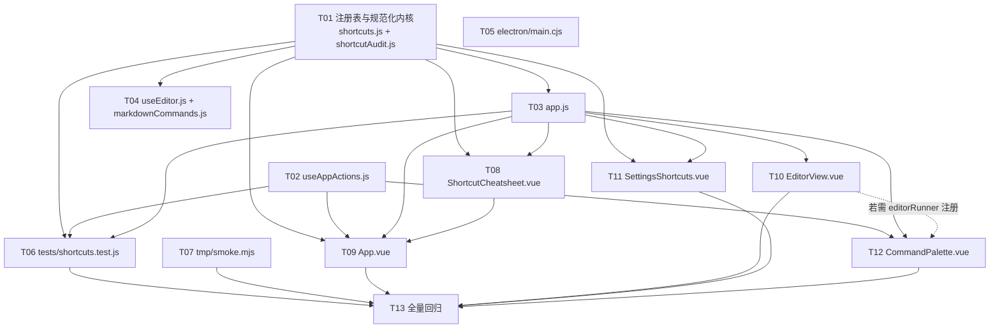
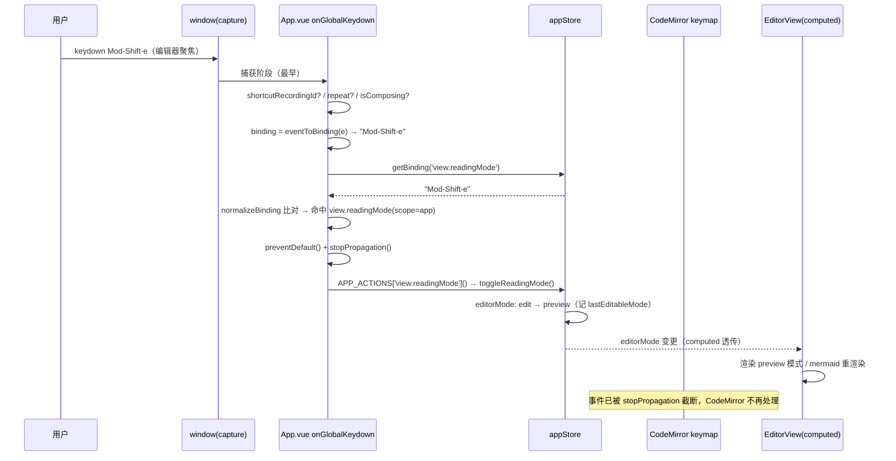
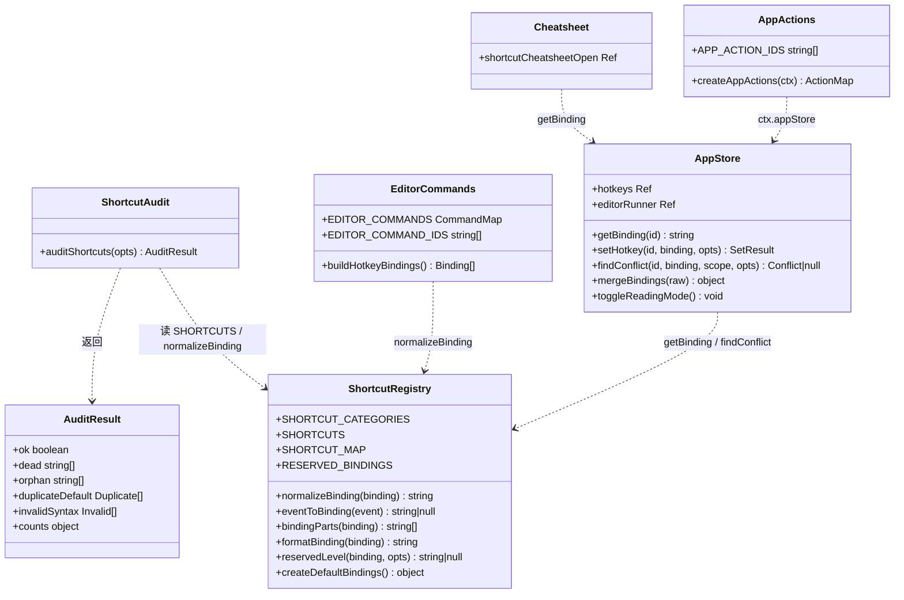

# 增量设计：完整完善快捷键功能

| 项 | 内容 |
| --- | --- |
| 需求名称 | 完整完善快捷键功能 |
| 文档类型 | 增量系统设计（架构师：高见远） |
| 上游输入 | `docs/shortcuts-incremental-prd.md`（381 行，已通读） |
| 项目 | choyeon-note（Electron + Vue 3 + Pinia + CodeMirror 6 + Vite） |
| Language | 中文 |
| 范围约束 | 不引入任何新依赖/新技术；`hotkeys` 持久化结构保持 1:1 且存原文；老用户已改键 100% 保留 |
| 基线 | `npx vitest run` 79/79 通过（5 文件）；`npx vite build` 通过 |

---

## 0. 总监裁决落地对照

| # | 裁决 | 本设计落地方式 |
| --- | --- | --- |
| 1 | Electron 菜单 vs 注册表 → **方案 A** | T05：`electron/main.cjs` 删除 `CmdOrCtrl+N/O/S/Shift+P/B` 五个自定义 accelerator；菜单项与 `click` 保留（鼠标可点）。renderer 成为键位唯一来源 |
| 2 | 本轮**只做覆盖校验**，不做单一命令总线重构 | `src/utils/shortcutAudit.js` 纯函数校验；§F 单列后续重构路径，本轮不实现 |
| 3 | 速查表默认键 = **`Mod-/`** | `app.shortcutCheatsheet` default `'Mod-/'`，不加 `?` 备选 |
| 4 | `insert.callout` / `insert.tag` **纳入 P1** | T04 新增 `md.insertCallout`（~15 行）+ `md.insertText('#')`；两者默认 `''` |
| 5 | `edit.toggleTask` **转正** | 去掉 `hidden`，default 改 `Mod-Shift-Enter` |
| 6 | `view.zoomIn/Out/Reset` 与菜单 `role: zoomIn/...` **并存** | 标签强制写「正文」二字：**放大正文 / 缩小正文 / 重置正文缩放** |
| 7 | `app.commandPalette` 保持 **`Mod-Shift-p`** | 不改；释放的 `Mod-p` 不新增命令占用（仅进 warn 级保留键提示） |
| 补 | PRD §3.2 所有 **P2 一律不做** | 星标/置顶、模板、日记、分屏、多窗口、幻灯片、`edit.foldCurrentHeading`、`edit.toggleComment`、`edit.indentAlt/outdentAlt`、多组合键、导入导出、非 US 布局 —— 全部不落地 |
| 补 | `hotkeys` 结构 1:1 存原文 | `mergeBindings` 语义不变；`normalizeBinding` 只用于**比较**，不回写 |

**已核实的现状事实**（读代码得出，非推测）：

- 注册表实际 44 条；`APP_ACTIONS` 11 条（App.vue 内普通对象，不可 import）；`EDITOR_COMMANDS` **35 条**（`useEditor.js` 已 export，实测 vitest 可直接 import，2ms，含全部 CodeMirror 依赖，无副作用问题）。
- 野命令实测 4 条：`format.h5`、`format.h6`、`insert.table`、`insert.time` —— 与 PRD 一致。
- **命令面板未读注册表**（PRD 要求"先核实"）：`CommandPalette.vue` 数据源是 `useCommands.js` 的 `quickActions`，id 命名空间是 `view:notes` / `note:new` 这类**冒号**格式，与注册表 `view.notes` / `app.newNote` 的**点号**格式完全无关；且模板里 `v-if="cmd.hotkey"` 的 `hotkey` 字段**从未被任何条目赋值**，命令面板目前一条快捷键都不显示。→ 需打通（§B8）。
- 硬编码 `Mod-s` 实际出现在 `useEditor.js` **两处**（第 521 行 `createExtensions`、第 658 行 `refreshKeymap`），不是一处。
- `EditorView.vue` 的 hack 实际范围是 **761–790 行（函数体）+ 790 行（onMounted 注册）+ 799 行（onUnmounted 摘除）**，共三处需删。
- 持久化 key 实际是 **`choyeon-hotkeys`**（`src/constants/storage.js`），不是 PRD 正文里写的 `choyeon-note-hotkeys`。
- 路由是 **`createWebHashHistory`** → 冒烟脚本不需要 SPA fallback。
- Node 版本 **v22.22.2** → 全局 `WebSocket` 可用，冒烟脚本可零依赖走 CDP。

---

## A. 现状结构与改动面

| 路径 | 现状职责 | 本轮改什么 | 风险点 |
| --- | --- | --- | --- |
| `src/constants/shortcuts.js` | 注册表 44 条 + `bindingParts` / `formatBinding` / `eventToBinding` / `createDefaultBindings`；**无规范化函数** | ① 新增 `normalizeBinding`、`CODE_TO_KEY`、`KEY_CANON`、`RESERVED_BINDINGS`、`reservedLevel()`；② `eventToBinding` 增加 `event.code` 主键反查 + IME/repeat 拦截；③ 注册表扩到 **59 条**（新增 15、改 default 6、改 scope 2、取消 hidden 2）；④ 所有 default 改成规范书写顺序 | **全轮最高风险文件**：`bindingParts` 的 `--` 结尾特判（`insert.divider` = `Mod-Alt--`）不能被新解析器破坏；`normalizeBinding` 必须幂等，否则录制→比较→重录会漂移。本文件必须最先完成且单独一个任务 |
| `src/utils/shortcutAudit.js`（新建） | — | 纯函数 `auditShortcuts({ appActionIds, editorCommandIds, shortcuts })` → `{ ok, dead, orphan, duplicateDefault, invalidSyntax, counts }`；**不 import 任何 vue / store / CodeMirror** | 判定口径要与 PRD P0-1 逐字对齐；`duplicateDefault` 必须**同 scope 分组**判定，否则 `app` 与 `editor` 同名键会误报 |
| `src/composables/useAppActions.js`（新建） | — | 导出 `createAppActions(ctx)`（把 App.vue 里的 `APP_ACTIONS` 原样搬出，所有外部依赖从 `ctx` 取）+ `export const APP_ACTION_IDS = Object.keys(createAppActions({}))` | 必须是**零 import 纯模块**（不 import store / router / vue），否则测试无法轻量 import。`createAppActions({})` 只能读属性、不能在构造期解引用 |
| `src/stores/app.js` | `hotkeys` / `getBinding` / `setHotkey` / `findConflict` / `mergeBindings` / 主题 / toast / 模态 | ① `findConflict` 增强返回 `{ id, label, severity, kind, reason }`；② `setHotkey(id, binding, { override })` 三态；③ `mergeBindings` 兼容不变（仅补注释）；④ 新增 `shortcutCheatsheetOpen` + 开/关/切；⑤ 新增 `toggleReadingMode()` + 内部 `lastEditableMode`；⑥ 新增 `editorRunner` shallowRef + `setEditorRunner`（命令面板执行 editor 命令用） | `setHotkey` 返回结构变化 → 唯一调用方 `SettingsShortcuts.vue` 必须同步改（T11）；`toggleReadingMode` 若与 EditorView 本地 `lastEditableMode` 不同步会行为不一致 → 两边都要改成本 store 版本 |
| `src/App.vue` | 全局 keydown 捕获监听 + `APP_ACTIONS` + `handleMenuAction` + 模态挂载 | ① 删除本地 `APP_ACTIONS` 定义，改 `createAppActions({ appStore, noteStore, router })`；② `onGlobalKeydown` 匹配改用 `normalizeBinding`，命中后 `preventDefault()` **+ `stopPropagation()`**；新增 `e.repeat` / `isComposing` 拦截；③ dev 期（或 debug flag）跑 `auditShortcuts` 并 `console.error`；④ 挂载 `<ShortcutCheatsheet />`；⑤ 新增 9 条 app 命令的执行体 | `stopPropagation` 会切断后续冒泡监听（`CommandPalette.onKeydown` 等）→ **只在确实命中命令时**调用；`APP_ACTIONS_NEED_UNFOCUSED` 不能误加 `view.readingMode` / `view.liveMode`，否则编辑器内按不生效 |
| `src/composables/useEditor.js` | `EDITOR_COMMANDS`（35）+ `buildHotkeyBindings` + `hotkeyCompartment` + 两处硬编码 `Mod-s` | ① 删除第 521、658 行的 `{ key: 'Mod-s', ... }`；② `buildHotkeyBindings` 传 CM 前 `normalizeBinding`；③ `withoutKeys(defaultKeymap, hotkeyKeys)` 的 `hotkeyKeys` 用规范化集合；④ 新增 `export const EDITOR_COMMAND_IDS = Object.keys(EDITOR_COMMANDS)`；⑤ 新增 `insert.tag` 条目 | 删硬编码后若 App.vue 未同步接管，编辑器内 Ctrl+S 会触发浏览器"保存网页"→ **T04 与 T09 必须联调**；`withoutKeys` 现在用的是小写化字符串，改成 `normalizeBinding` 后行为要一致 |
| `src/utils/editor/markdownCommands.js` | 40+ 个 Markdown 编辑命令 | 新增 `insertCallout`（约 15 行，插入 `> [!note]` 块）；`insert.tag` 复用已有 `insertText('#')` 无需新增 | `insertCallout` 要处理「行首 / 空行 / 已有引用前缀」三种上下文，否则插入后格式破碎 |
| `src/views/EditorView.vue` | 编辑器页 + 模式切换 + `onModeKeydown` hack | **删除** 761–780 行 `onModeKeydown` 函数体、790 行 `onMounted` 内注册、799 行 `onUnmounted` 内摘除；`toggleReadingMode` 改调 `appStore.toggleReadingMode()`，删除本地 `lastEditableMode` | 删 hack 后**必须**先确保 App.vue 的 app-scope 调度已生效（依赖 T09）；否则出现"改键后阅读模式切换彻底失效"的回归 |
| `src/components/ShortcutCheatsheet.vue`（新建） | — | app 级模态：搜索 + 5 分类分组 + 两列网格 + 已自定义打点 + 未设置灰字 + Esc/遮罩关闭 + 底部「打开快捷键设置」 | 只读 `SHORTCUTS` + `appStore.getBinding`，不写任何状态；不得引入新 CSS 变量 |
| `src/components/CommandPalette.vue` | 命令面板（`useCommands.quickActions`） | 注入注册表派生的命令：把 `scope==='app'` 的注册表条目（经 `createAppActions` 执行）+ `scope==='editor'` 条目（经 `appStore.editorRunner` 执行）合并进 `ranked`，并填充 `hotkey` 角标 | `useCommands.js` **本轮不改**（避免文件重叠）；合并后要避免与 `useCommands` 已有条目重复显示（"新建笔记"两处都有）→ 用 id 去重或保留两侧并标注 |
| `src/views/settings/SettingsShortcuts.vue` | 设置页快捷键区（搜索 / 录制 / 重置已有） | ① 「仅看已修改」开关；② 冲突行 `--state-error` 描边 + 「与「X」冲突 · [强行覆盖]」；③ 保留键 warn 图标 + tooltip；④ 录制兜底（点其它行 / 点空白 / 路由离开 → `stopRecording()`）；⑤ 录制实时预览胶囊；⑥ 适配 `setHotkey` 新返回结构 | 录制监听是 **capture + stopPropagation**，兜底没做会一直吞键（PRD 已列为现状缺陷）；`onRecordKeydown` 里 Escape 判断要放在 `eventToBinding` 之前 |
| `electron/main.cjs` | 主进程 + 应用菜单 | 删除 5 个与注册表重叠的自定义 accelerator：`CmdOrCtrl+N`（398）、`CmdOrCtrl+O`（405）、`CmdOrCtrl+S`（413）、`CmdOrCtrl+B`（439）、`CmdOrCtrl+Shift+P`（465）；`click` 与菜单项保留 | `role: undo/redo/selectAll`（425/426/431）与 `Mod-z/Mod-y/Mod-a` **仍重叠**，可能双触发 → 见 §E-4；`CmdOrCtrl+T`（切换主题，473）不重叠但同族，见 §E-5 |
| `tests/shortcuts.test.js`（新建） | — | 覆盖：audit 四类 + 人为注入捕获 + `normalizeBinding` 边界表 + `eventToBinding` code 反查/IME/回落 + `setHotkey` 三态 + 保留键分级 + 持久化原文 + `mergeBindings` 兼容 | jsdom 下 `KeyboardEvent.code` 默认为空 → 测试必须显式构造 `{ key, code }`，否则走回落分支 |
| `tmp/smoke.mjs`（新建/重建） | 上一轮误删，当前不存在 | 见 §B10：build → 静态服务 → CDP（Node 22 内置 WebSocket，零依赖）→ 过欢迎页 → 逐视图 → 进编辑器 → 汇总 `ERRORS(n)` | 端口 9222 占用 / Chrome 路径探测失败要有明确错误码；各任务并行构建请用各自 `--outDir`，只有冒烟用 `tmp/distcheck` |
| `src/components/MarkdownEditor.vue` | 装配 `useEditor`，传 `getBinding` / `onSave` | **本轮不改**（规范化在 `buildHotkeyBindings` 内部完成） | — |

---

## B. 关键设计

### B1. `normalizeBinding(str)` —— 单一比较口径

**签名**：`normalizeBinding(binding: unknown) => string`。返回 `''` 表示「空 / 非法」。

**算法（顺序执行）**：

1. **空值**：非 string → `''`；`trim()` 后为空 → `''`。
2. **分隔符归一**：若串中**不含 `-`** 但含 `+`，则把 `+` 全部替换为 `-`（兼容用户手改 localStorage 的 `Ctrl+Alt+X`）。**含 `-` 时绝不按 `+` 切分**——否则 `Mod-+`（主键为 `+`）会被切坏。
3. **左→右切分**：按 `-` split。从头开始，若片段（小写后）属于修饰键集合 `{mod, ctrl, control, meta, shift, alt, option, opt}`，收进 `mods`；**遇到第一个非修饰键片段时停止，其后全部片段用 `-` join 起来作为主键**（这一步是 `Mod-Alt--` / `Mod--` 能被正确解析的关键）。
4. **主键归一**：
   - 长度 1 → `toLowerCase()`（`D`→`d`、`*`→`*`）；
   - 长度 > 1 → 先 `toLowerCase()` 查 `KEY_CANON` 表（`arrowup`→`ArrowUp`、`esc`→`Escape`、`del`→`Delete`、`space`→`Space`、`return`→`Enter`…），命中用规范名；未命中**原样返回**（不猜大小写，避免 `arrowup`→`Arrowup`）。
5. **修饰键去重 + 排序**：去重后按固定序 `Mod → Ctrl → Meta → Shift → Alt` 排列。
   - 注：`Ctrl` / `Meta` **不并入 `Mod`**（语义不同：`Mod` = Ctrl(Win) / Cmd(mac)，而 `Meta` 在 Win 是 Win 键）。注册表与录制器都只产出 `Mod/Shift/Alt`，`Ctrl/Meta` 仅为兼容历史数据保留位次。
6. 主键为空（如 `Mod-`、`Mod-Alt-`）→ 返回 `''`（会被 audit 判为 `invalidSyntax`）。

**必须幂等**：`normalizeBinding(normalizeBinding(x)) === normalizeBinding(x)`。单测要断言。

**边界用例表**（直接作为 T06 的测试数据）：

| 输入 | 输出 | 说明 |
| --- | --- | --- |
| `''` / `null` / `undefined` / `'   '` | `''` | 空 |
| `'Mod-Alt--'` | `'Mod-Alt--'` | 主键 `-`（`insert.divider`） |
| `'Mod--'` | `'Mod--'` | 主键 `-`（`view.zoomOut` 计划用） |
| `'Mod-='` | `'Mod-='` | 主键 `=`（`view.zoomIn`） |
| `'Shift-/'` | `'Shift-/'` | 主键 `/` |
| `'Shift-Mod-d'` | `'Mod-Shift-d'` | **重排**（`edit.duplicateLine` 现状写法） |
| `'MOD-SHIFT-D'` | `'Mod-Shift-d'` | 大小写 |
| `'Mod-Shift-Z'` | `'Mod-Shift-z'` | 单字符主键小写 |
| `'Mod-Mod-a'` | `'Mod-a'` | 重复修饰符去重 |
| `'Mod-'` / `'Mod-Alt-'` | `''` | 缺主键 → invalidSyntax |
| `'Tab'` / `'Shift-Tab'` | `'Tab'` / `'Shift-Tab'` | 纯主键 |
| `'Mod-Shift-8'` | `'Mod-Shift-8'` | `format.bulletList` 默认键 |
| `'mod-shift-ARROWLEFT'` | `'Mod-Shift-ArrowLeft'` | `app.navigateBack` |
| `'Mod-+'` | `'Mod-+'` | 主键 `+`（含 `-`，不按 `+` 切） |
| `'Ctrl+Alt+X'` | `'Ctrl-Alt-x'` | 无 `-` 时才按 `+` 切 |

**改造后的调用点**（全项目绑定串比较一律先过它）：

- `appStore.findConflict`
- `appStore.setHotkey`
- `App.vue` 的 `onGlobalKeydown` 匹配
- `useEditor.buildHotkeyBindings`（传给 CodeMirror 前）+ `withoutKeys` 的剔除集合
- `SettingsShortcuts.vue` 的冲突判定展示
- `shortcutAudit` 的 `duplicateDefault` / `invalidSyntax`

**持久化不受影响**：`hotkeys` 里仍存用户录制的**原文**，`normalizeBinding` 只在读取比较时调用，`persistHotkeys` 不改写。

### B2. `eventToBinding(event)` —— `event.code` 主键反查

**签名不变**：`eventToBinding(event) => string | null`。

**新增前置拦截**（返回 `null`）：

| 条件 | 原因 |
| --- | --- |
| `!event` / `!event.key` | 无主键 |
| `event.repeat === true` | 长按不重复触发（速查表 `Mod-/` 尤其明显） |
| `event.isComposing === true` \|\| `event.keyCode === 229` | **IME 组字中**（中日韩输入法），`key` 是临时值 |
| `event.key === 'Dead'` | 死键（组合音标） |
| `event.key ∈ {Control, Shift, Alt, Meta, CapsLock, OS}` | 单独按修饰键 |

**主键解析 `resolveMainKey(event)`**：

```js
const CODE_TO_KEY = {
  // 数字行
  Digit0:'0', Digit1:'1', Digit2:'2', Digit3:'3', Digit4:'4',
  Digit5:'5', Digit6:'6', Digit7:'7', Digit8:'8', Digit9:'9',
  Minus:'-', Equal:'=',
  // 字母区
  KeyA:'a', KeyB:'b', /* … */ KeyZ:'z',
  // 符号区
  BracketLeft:'[', BracketRight:']', Backslash:'\\',
  Semicolon:';', Quote:"'", Comma:',', Period:'.', Slash:'/', Backquote:'`',
  // 控制 / 导航
  Space:'Space', Enter:'Enter', Tab:'Tab', Escape:'Escape', Backspace:'Backspace',
  Delete:'Delete', Insert:'Insert', Home:'Home', End:'End',
  PageUp:'PageUp', PageDown:'PageDown',
  ArrowUp:'ArrowUp', ArrowDown:'ArrowDown', ArrowLeft:'ArrowLeft', ArrowRight:'ArrowRight',
  ContextMenu:'ContextMenu'
}
```

判定：**`event.code` 命中 `CODE_TO_KEY` → 无条件用映射值**；否则回落 `event.key`。

> 为什么不做「布局自检」（拿 `event.key` 去校验映射值是否吻合）？因为一旦校验失败就回落 `event.key`，会出现「同一物理键两次录制得到不同串」的漂移；而**无条件用 code 是自洽的**——显示的是物理键名，用户下次按同一物理键仍得到同一串。非 US 布局的正确显示本轮属 P2 不做。

**回落 `event.key` 的情形**（`return` 前再走一次归一）：

- `event.code` 为空或 undefined（jsdom 合成事件、部分自动化事件）；
- `event.code` 不在表内：`Numpad*`、`IntlBackslash`、`MediaPlayPause`、`AudioVolumeUp`、以及各厂商私有 code；
- 命中表但 `event.key` 已是多字符规范名且不在 `KEY_CANON`（如 `F13`、`LaunchApp1`）→ 直接原样返回。

**回落后的归一**：`key === ' '` → `'Space'`；`key.length === 1` → `toLowerCase()`；否则原样。

**修饰符组装**保持现状：`ctrlKey || metaKey → 'Mod'`、`shiftKey → 'Shift'`、`altKey → 'Alt'`。

**最终返回**：`normalizeBinding([...mods, main].join('-'))` → 天然规范序 **Mod-Shift-Alt-Key**。

**关键验收**：在设置页录制 `Ctrl+Shift+8`，`event.key === '*'`、`event.code === 'Digit8'` → 返回 `'Mod-Shift-8'`，与 `format.bulletList` 的 default **字符串相等**，列表功能立即生效。

### B3. `auditShortcuts({ appActionIds, editorCommandIds })` 与 id 集合静态化

**难点**：`APP_ACTIONS` 现在是 `App.vue` `<script setup>` 里的普通对象，测试无法 import。**解决方案（两条腿）**：

**腿 1 —— 执行器搬到可 import 的纯模块，id 从对象派生**（推荐，本轮采用）：

```js
// src/composables/useAppActions.js   —— 零 import 纯模块
export function createAppActions (ctx = {}) {
  return {
    'app.newNote':        () => { const n = ctx.noteStore.createNote('', '新笔记'); ctx.router.push(`/editor/${n.id}`) },
    'app.save':           () => { if (ctx.noteStore.currentNote?.id) ctx.noteStore.flushSave?.(ctx.noteStore.currentNote.id) },
    'app.quickSwitcher':  () => ctx.appStore.openQuickSwitcher(),
    'app.commandPalette': () => ctx.appStore.toggleCommandPalette(),
    'app.vault':          () => ctx.router.push('/vault'),
    'app.settings':       () => ctx.router.push('/settings'),
    'app.navigateBack':   () => ctx.router.back(),
    'app.navigateForward':() => ctx.router.forward(),
    'app.shortcutCheatsheet': () => ctx.appStore.toggleShortcutCheatsheet(),
    'view.toggleSidebar': () => ctx.appStore.toggleSidebar(),
    'view.toggleRightPanel': () => ctx.appStore.toggleRightPanel(),
    'view.readingMode':   () => ctx.appStore.toggleReadingMode(),
    'view.liveMode':      () => ctx.appStore.setEditorMode('live'),
    'view.graph':         () => ctx.router.push('/graph'),
    'view.calendar':      () => ctx.router.push('/calendar'),
    'view.search':        () => ctx.router.push('/search'),
    'view.notes':         () => ctx.router.push('/notes'),
    'view.tags':          () => ctx.router.push('/tags'),
    'view.toggleTheme':   () => ctx.appStore.toggleTheme(),
    'view.zoomIn':        () => ctx.appStore.setEditorZoom((Number(ctx.appStore.editorZoom) || 100) + 10),
    'view.zoomOut':       () => ctx.appStore.setEditorZoom((Number(ctx.appStore.editorZoom) || 100) - 10),
    'view.zoomReset':     () => ctx.appStore.resetEditorZoom()
  }
}

/** 从对象派生 —— 不存在第二份手工清单 */
export const APP_ACTION_IDS = Object.keys(createAppActions({}))
```

> `createAppActions({})` 合法：所有属性访问都发生在**闭包调用时**，构造期不触碰 `ctx` 内部。

```js
// src/composables/useEditor.js 末尾追加（已实测 vitest 可 import，2ms）
export const EDITOR_COMMAND_IDS = Object.keys(EDITOR_COMMANDS)
```

**腿 2 —— dev 期一致性守卫**（防"对象改了、清单没改"的漂移）：

```js
// App.vue onMounted，DEV 下
if (import.meta.env.DEV || localStorage.getItem('choyeon-debug-audit') === '1') {
  const drift = APP_ACTION_IDS.filter(id => !APP_ACTIONS[id])
    .concat(Object.keys(APP_ACTIONS).filter(id => !APP_ACTION_IDS.includes(id)))
  if (drift.length) console.error('[shortcut-audit] APP_ACTIONS 与 APP_ACTION_IDS 漂移：', drift)
  const r = auditShortcuts({ appActionIds: Object.keys(APP_ACTIONS), editorCommandIds: EDITOR_COMMAND_IDS })
  if (!r.ok) console.error('[shortcut-audit] 注册表校验未通过：', r)
}
```

> `choyeon-debug-audit` flag 的作用：让 `vite build` 产物也能跑 audit，冒烟脚本（§B10）就能捕获审计错误。

**`auditShortcuts` 签名与返回**：

```js
// src/utils/shortcutAudit.js —— 纯函数，不 import 任何运行时模块
export function auditShortcuts ({
  appActionIds = [],
  editorCommandIds = [],
  shortcuts = SHORTCUTS,
  normalize = normalizeBinding
} = {}) => {
  ok: boolean,
  dead: string[],                                  // 非 hidden 的注册表命令，但对应 scope 无执行器
  orphan: string[],                                // 执行器有、注册表无
  duplicateDefault: [{ scope, binding, ids: [] }],  // 规范化后同 scope 内默认键重复
  invalidSyntax: [{ id, scope, default, reason }],  // reason: empty-key | unknown-scope | duplicate-id | not-normalized
  counts: { dead, orphan, duplicateDefault, invalidSyntax }
}
```

**四类判定规则**：

| 类别 | 判定 |
| --- | --- |
| `dead` | 遍历 `shortcuts`，跳过 `hidden`；`scope === 'app'` 查 `appActionIds`、`scope === 'editor'` 查 `editorCommandIds`；查不到 → `dead.push(id)` |
| `orphan` | `appActionIds ∪ editorCommandIds` 中不在注册表 id 集合的（同时校验：editor 执行器 id 不应出现在 appActionIds 里，反之亦然） |
| `duplicateDefault` | 按 `scope` 分组；`key = normalize(s.default)`；**跳过空 default 与 normalize 后为空的**；同 key 出现 ≥2 条 → `{ scope, binding: key, ids }`。**跨 scope 不算** |
| `invalidSyntax` | `default` 非空但 `normalize` 后为空 → `empty-key`；`scope` 不在 `{app, editor}` → `unknown-scope`；注册表内 id 重复 → `duplicate-id`；`normalize(s.default) !== s.default` → `not-normalized`（自动抓出 `Shift-Mod-d` 这类遗留书写） |

`ok = counts 四项全为 0`。

### B4. `RESERVED_BINDINGS` 分级 + `findConflict` / `setHotkey` 三态

```js
// src/constants/shortcuts.js
export const RESERVED_BINDINGS = {
  // 硬拒绝：任何环境都不可拦截，override 也无效
  hard: {
    'Mod-w': '系统保留：关闭窗口（不可拦截）',
    'Mod-q': '系统保留：退出应用（不可拦截）',
    'Mod-Shift-w': '系统保留：关闭窗口（不可拦截）',
    'Mod-Shift-q': '系统保留：退出应用（不可拦截）',
    'Mod-t': '浏览器保留：新建标签页（不可拦截）',
    'Mod-Shift-t': '浏览器保留：恢复关闭的标签页（不可拦截）',
    'Mod-Shift-n': '浏览器保留：新建隐身窗口（不可拦截）',
    'F11': '系统保留：全屏切换'
  },
  // 仅非 Electron 环境升级为硬拒绝（Electron 下菜单已让路，renderer 可接管）
  browserOnly: {
    'Mod-n': '浏览器保留：新建窗口（Electron 下已释放）',
    'Mod-Shift-i': '浏览器保留：开发者工具（Electron 下已释放）',
    'Mod-Shift-j': '浏览器保留：开发者工具（Electron 下已释放）',
    'Mod-Shift-c': '浏览器保留：检查元素（Electron 下已释放）'
  },
  // 警告：允许写入，但会在设置页与速查表给出提示
  warn: {
    'Escape': '保留键：会阻断关闭模态 / 取消操作',
    'Enter': '保留键：会阻断换行与确认',
    'Backspace': '保留键：会阻断删除',
    'Delete': '保留键：会阻断删除',
    'Tab': '保留键：会阻断键盘焦点移动（无障碍）',
    'Shift-Tab': '保留键：会阻断键盘反向焦点移动（无障碍）',
    'Mod-f': '保留键：编辑器内查找由 CodeMirror 提供',
    'Mod-p': '保留键：系统打印习惯',
    'Mod-a': '系统级行为：全选（Electron 菜单 role 可能重复触发）',
    'Mod-c': '系统级行为：复制',
    'Mod-v': '系统级行为：粘贴',
    'Mod-x': '系统级行为：剪切',
    'Mod-z': '系统级行为：撤销（Electron 菜单 role 可能重复触发）',
    'Mod-y': '系统级行为：重做（Electron 菜单 role 可能重复触发）',
    'Mod-=': '浏览器中可能被浏览器缩放占用',
    'Mod--': '浏览器中可能被浏览器缩放占用',
    'Mod-0': '浏览器中可能被浏览器重置缩放占用',
    'F5': '浏览器保留：刷新',
    'F12': '浏览器保留：开发者工具'
  }
}

/** 返回 'hard' | 'warn' | null */
export function reservedLevel (binding, { isElectron = IS_ELECTRON } = {}) { /* hard → browserOnly(非 Electron) → warn → null */ }
```

> **关键**：`Mod-n` 在 Electron 下是 `app.newNote` 的默认键（裁决 1 后菜单已让路），绝不能被硬拒绝。`browserOnly` 分级就是解决这个矛盾。

**`findConflict` 新签名**：

```js
findConflict(id, binding, scope?, { isElectron = IS_ELECTRON } = {})
// → null | { id, label, severity: 'block' | 'warn', kind, reason }
// kind: 'reserved-hard' | 'reserved-browser' | 'reserved-warn' | 'same-scope' | 'cross-scope'
```

判定顺序（短路返回）：`reserved-hard` → `reserved-browser`（仅非 Electron）→ `same-scope`（block）→ `reserved-warn` → `cross-scope`（warn）→ `null`。
> 同 scope 实占排在 `reserved-warn` 之前：实打实的冲突优先于"可能有问题"。

**`setHotkey` 三态**：

```js
setHotkey(id, binding, { override = false, isElectron = IS_ELECTRON } = {})
```

| 状态 | 触发条件 | 行为 | 返回 |
| --- | --- | --- | --- |
| **ok** | 无冲突，或仅 `warn` 级 | 直接写入 + `persistHotkeys()` | `{ ok: true, overridden: [] }` |
| **need-override** | `severity === 'block'`：同 scope 实占 / 非 Electron 下的 browserOnly | **不写**；UI 显示「与「X」冲突 · [强行覆盖]」 | `{ ok: false, status: 'conflict', canOverride: true, conflict }` |
| **rejected** | `kind === 'reserved-hard'` | 任何情况都不写 | `{ ok: false, status: 'reserved', canOverride: false, conflict }` |
| （其它） | id 不存在 / 输入非法 | 不写 | `{ ok: false, status: 'unknown' \| 'invalid' }` |

`override: true` 且冲突来源是**命令占用**（非保留键）时：把 `conflict.id` 的绑定置为 `''`，再写自己，一次 `persistHotkeys()`，返回 `{ ok: true, overridden: [conflict.id] }`。

**默认键自伤豁免**：若 `normalizeBinding(next) === normalizeBinding(SHORTCUT_MAP[id].default)`，跳过 reserved 检查（否则 `app.newNote = Mod-n`、`view.zoomOut = Mod--` 这类默认键自己会被判死）。

> **兼容影响**：唯一调用方 `SettingsShortcuts.vue` 现在读 `result.reason === 'conflict'` / `result.conflict.label`，必须同步改为 `result.status` / `result.conflict`（T11 负责）。

### B5. `view.readingMode` / `view.liveMode` 改 app scope 后的执行路径

**事件顺序（编辑器聚焦时按 `Mod-Shift-e`）**：

```
① window 捕获阶段  ← App.vue onGlobalKeydown（addEventListener(el,'keydown',fn,true)）★ 最早
② 目标阶段        ← document.activeElement = CodeMirror 的 .cm-content（contenteditable）
③ 冒泡：.cm-content → … → document → window 冒泡监听（CommandPalette.onKeydown 等）
   CodeMirror 的 keymap 在 ②③ 之间处理（挂在 view.contentDOM，非 capture）
```

**结论：App.vue 的捕获监听严格早于 CodeMirror，不会被抢。** 前提是命中后必须阻断：

```js
if (!matched) return                     // 未命中：不 preventDefault、不 stopPropagation（保持现状）
if (NEED_UNFOCUSED.has(matched.id) && inEditable) return
e.preventDefault()
e.stopPropagation()                      // ★ 新增：确定性阻断 CodeMirror 与后续冒泡监听
APP_ACTIONS[matched.id]()
```

**完整判定条件（`onGlobalKeydown`）**：

1. `appStore.shortcutRecordingId` 非空 → `return`（录制中让路，**保持现状**）
2. `e.repeat` → `return`（新增）
3. `e.isComposing || e.keyCode === 229` → `return`（新增，IME）
4. `e.key === 'Escape' && !inEditable` → 关模态后 `return`（**保持现状**）
5. `const binding = eventToBinding(e)`；`!binding` → `return`
6. 匹配：`SHORTCUTS.find(s => s.scope === 'app' && !s.hidden && APP_ACTIONS[s.id] && normalizeBinding(appStore.getBinding(s.id)) === binding)`
7. 未命中 → `return`（**不** stopPropagation）

**`APP_ACTIONS_NEED_UNFOCUSED` 保持 `['app.newNote', 'view.toggleSidebar']` 不变** —— `view.readingMode` / `view.liveMode` **绝不能**加入，否则编辑器聚焦时（`inEditable === true`）会被拦掉，就白改 scope 了。

**「当前页面不适用」的处理**：`view.readingMode` / `view.liveMode` 我建议**不弹 toast，直接改全局 `appStore.editorMode`**——`editorMode` 是持久化的全局状态，在任何页面按下都会立刻生效（下次进编辑器即该模式），语义上不存在"不适用"。见 §E-2。

**`toggleReadingMode` 收进 store**（App.vue 与 EditorView 共用，避免两份 `lastEditableMode`）：

```js
const lastEditableMode = ref('edit')      // 不持久化
function toggleReadingMode () {
  if (editorMode.value !== 'preview') {
    lastEditableMode.value = editorMode.value
    setEditorMode('preview')
  } else {
    setEditorMode(lastEditableMode.value || 'edit')
  }
}
```

### B6. 删除硬编码 `Mod-s` 后 `app.save` 的单通道

删除点：`useEditor.js` **第 521 行**（`createExtensions`）与 **第 658 行**（`refreshKeymap`）。

**删除后的路径（编辑器内按 `Mod-s`）**：

1. window 捕获阶段 → App.vue 命中 `app.save`（读用户当前绑定，默认 `Mod-s`）→ `preventDefault()` + `stopPropagation()` → `noteStore.flushSave(currentNoteId)`；
2. `stopPropagation` 后 CodeMirror 收不到事件 → **不会二次执行**（CodeMirror 里已无 `Mod-s` 绑定）；
3. Electron 菜单 `CmdOrCtrl+S` 已删（T05）→ 主进程不再发 `menu:save`；
4. 浏览器里 `Ctrl+S` 的"保存网页"被 `preventDefault` 拦掉。

→ **唯一通道**。验收「把 `app.save` 改成 `Mod-Alt-s` 后，编辑器内按 `Mod-s` 不再保存」自动成立。

**配套**：`buildHotkeyBindings` 在 `push({ key, ... })` 前 `key = normalizeBinding(key)`；`withoutKeys(defaultKeymap, hotkeyKeys)` 的 `hotkeyKeys` 同样用规范化集合（否则 `Mod-Shift-d` 与 default keymap 里同键的写法对不上，剔除失效）。

### B7. 命令表变更总表（44 → **59**）

> PRD 验收总纲写的「48 条」是**只含 P0 收编**的口径；加上总监批准的 P1 批次后实际为 **59 条**。

**新增 15 条**：

| id | 标签 | 默认键 | scope | category | 执行器 |
| --- | --- | --- | --- | --- | --- |
| `format.h5` | 五级标题 | `Mod-Alt-5` | editor | format | 已有 |
| `format.h6` | 六级标题 | `Mod-Alt-6` | editor | format | 已有 |
| `insert.table` | 插入表格（3×3） | `Mod-Alt-t` | editor | insert | 已有 |
| `insert.time` | 插入当前时间 | `''` | editor | insert | 已有 |
| `insert.callout` | 插入 Callout | `''` | editor | insert | **新增** `md.insertCallout` |
| `insert.tag` | 插入标签 | `''` | editor | insert | `md.insertText('#')` |
| `app.navigateBack` | 导航后退 | `Mod-Alt-ArrowLeft` | app | view | `router.back()` |
| `app.navigateForward` | 导航前进 | `Mod-Alt-ArrowRight` | app | view | `router.forward()` |
| `view.toggleRightPanel` | 切换右侧面板 | `Mod-Alt-r` | app | view | `appStore.toggleRightPanel` |
| `view.zoomIn` | **放大正文** | `Mod-=` | app | view | `setEditorZoom(+10)` |
| `view.zoomOut` | **缩小正文** | `Mod--` | app | view | `setEditorZoom(-10)` |
| `view.zoomReset` | **重置正文缩放** | `Mod-0` | app | view | `resetEditorZoom()` |
| `view.notes` | 笔记列表 | `''` | app | view | `router.push('/notes')` |
| `view.tags` | 标签视图 | `''` | app | view | `router.push('/tags')` |
| `app.shortcutCheatsheet` | 快捷键速查表 | `Mod-/` | app | view | `toggleShortcutCheatsheet()` |

**修改 10 条**：

| id | 改什么 | 前后 |
| --- | --- | --- |
| `view.readingMode` | scope | `editor` → **`app`**（default `Mod-Shift-e` 不变） |
| `view.liveMode` | scope + default + hidden | `editor` → **`app`**；`Mod-Shift-l` → **`Mod-Alt-l`**（避让 `insert.wikiLink`）；**取消 hidden** |
| `edit.toggleTask` | hidden + default | 取消 hidden；`Mod-Enter` → **`Mod-Shift-Enter`** |
| `edit.duplicateLine` | default 书写 | `Shift-Mod-d` → **`Mod-Shift-d`** |
| `insert.date` | default | `Mod-Shift-d` → **`Mod-Alt-d`**（保持 hidden） |
| `edit.redoAlt` | default 书写 | `Shift-Mod-z` → **`Mod-Shift-z`**（保持 hidden） |
| `view.calendar` | default | `Mod-Shift-c` → **`Mod-Alt-k`**（`Ctrl+Shift+C` 是 DevTools 检查元素） |
| `view.toggleTheme` | 无改动，仅设置页加 warn 提示 | — |
| `edit.undo` / `edit.redo` / `edit.selectAll` | 无改动，仅设置页标注「系统级行为」 | — |

### B8. 命令面板打通（`CommandPalette.vue`）

**核实结果**：确未读注册表（数据源 `useCommands.js`，id 用冒号命名空间，`hotkey` 字段从未赋值）。

**本轮方案（低成本，不触碰 `useCommands.js`，不违反裁决 2）**：在 `CommandPalette.vue` 里**从注册表派生**命令条目，与 `useCommands.quickActions` 合并：

```js
import { createAppActions } from '@/composables/useAppActions'
import { SHORTCUTS, SHORTCUT_CATEGORIES, formatBinding } from '@/constants/shortcuts'

const actions = createAppActions({ appStore, noteStore, router })

const registryCommands = computed(() =>
  SHORTCUTS
    .filter(s => !s.hidden)
    .map(s => ({
      id: s.id,
      section: SHORTCUT_CATEGORIES.find(c => c.id === s.category)?.label || '其他',
      label: s.label,
      keywords: s.id,
      hotkey: formatBinding(appStore.getBinding(s.id)),   // ← 填上角标
      action: () => (s.scope === 'app' ? actions[s.id]?.() : appStore.editorRunner?.(s.id))
    }))
)
```

- **app scope**：由 `createAppActions` 直接执行（与 App.vue 同一份代码，天然同步）。
- **editor scope**：经 `appStore.editorRunner(s.id)` 执行——`EditorView` 在 `onMounted` 注册 `appStore.setEditorRunner(id => editorApi.applyCommand(id))`，`onUnmounted` 置空。3 行代码，解决"editor 命令在面板里可搜可执行"的验收要求（§E-3 需裁决）。
- 合并时对 `useCommands` 已有条目做 id/label 去重（如「新建笔记」两处都有，保留注册表版本）。

### B9. `ShortcutCheatsheet.vue` 契约

- store 新增：`shortcutCheatsheetOpen` ref + `openShortcutCheatsheet()` / `closeShortcutCheatsheet()` / `toggleShortcutCheatsheet()`。
- 数据源：`SHORTCUTS`（排除 `hidden`）+ `appStore.getBinding(id)`（**显示用户改过之后的键位**）。
- 渲染：顶部搜索（label + 按键名）+ 5 分类分组 + 两列网格（窄屏单列）+ 已自定义项打 `--color-primary-surface` 小圆点 + 未绑定显示 `--color-text-tertiary` 的「未设置」。
- 交互：`Escape` / 点遮罩关闭；打开时焦点落搜索框；底部「打开快捷键设置 →」跳 `/settings`。
- 不写任何状态、不引入新 CSS 变量（复用 §D 列出的变量与类）。

### B10. `tmp/smoke.mjs` 重建规格

**目标**：`ERRORS(0)`。零第三方依赖（Node 22 内置 `fetch` + `WebSocket`）。

**流程**：

1. **构建**：`npx vite build --outDir tmp/distcheck --emptyOutDir=false`（脚本内 `child_process.spawnSync`，支持 `--no-build` 跳过）。
   > 并行任务的构建请各自用 `--outDir tmp/distcheck-<名字>`，**只有冒烟用 `tmp/distcheck`**。
2. **静态服务**：`node:http` 起服务（默认 9333），MIME 映射 `.html/.js/.css/.svg/.png/.woff2`；hash 路由 → 不需要 SPA fallback。
3. **拉 Chrome**：按序探测 `%LOCALAPPDATA%\Google\Chrome\Application\chrome.exe` → `C:\Program Files\Google\Chrome\Application\chrome.exe` → `CHROME_PATH` 环境变量；spawn 参数：
   `--headless=new --remote-debugging-port=9222 --user-data-dir=<tmp/smoke-profile> --no-first-run --disable-gpu --allow-file-access-from-files`
4. **CDP**：`fetch('http://127.0.0.1:9222/json/version')` → `webSocketDebuggerUrl` → `new WebSocket(url)` → `Target.createTarget` + `Target.attachToTarget` 拿 `sessionId` → `Page.enable` / `Runtime.enable` / `Log.enable`。
5. **过欢迎页**：`Page.navigate` → 等 `Page.loadEventFired` → `Runtime.evaluate`：
   ```js
   localStorage.setItem('choyeon-notes-location', 'sample')
   localStorage.setItem('choyeon-debug-audit', '1')   // ← 让构建产物也跑 audit
   ```
   → `Page.reload`。
6. **逐视图**：hash 路由直接 `location.hash = '#/notes' | '#/tags' | '#/calendar' | '#/graph' | '#/search' | '#/vault' | '#/settings'`，每个视图停 400ms 并 `Runtime.evaluate` 断言根容器非空。
7. **进编辑器**：`Runtime.evaluate` 取第一篇笔记 id → `location.hash = '#/editor/' + id` → 等 800ms → 断言 `.cm-content` 存在 → 模拟输入一次（`Input.dispatchKeyEvent` 或直接 evaluate 触发一次 `app.save` 路径）。
8. **汇总**：`Runtime.consoleAPICalled`（`type === 'error'`）+ `Log.entryAdded`（`level === 'error'`）→ 打印 `ERRORS(n)` 与明细；`n > 0` 时 `process.exit(1)`。

**错误处理**：给出可读错误码（`CHROME_NOT_FOUND` / `CDP_CONNECT_FAIL` / `BUILD_FAIL` / `NAV_TIMEOUT`），不静默吞。

---

## C. 任务分解

> **并行硬约束**：同批次内并行任务的**涉及文件必须完全不重叠**（上一轮因并行编辑同一文件丢过 4 处改动）。下表已按此约束切分。

### 批次 1 · 基础设施（必须先完成；T01 / T02 可并行）

| 编号 | 任务 | 涉及文件 | 依赖前序 | 验收标准 | 复杂度 |
| --- | --- | --- | --- | --- | --- |
| **T01** | 注册表与规范化内核 | `src/constants/shortcuts.js`（改）、`src/utils/shortcutAudit.js`（新建） | — | ① `normalizeBinding` 通过 §B1 全表边界用例且幂等；② `eventToBinding` 支持 `code` 反查 + IME/repeat 拦截；③ 注册表扩到 59 条、default 全规范书写、scope/hidden 按 §B7；④ `RESERVED_BINDINGS` + `reservedLevel()` 就绪；⑤ `auditShortcuts` 四类判定符合 §B3 | **大** |
| **T02** | App 执行器抽取为纯模块 | `src/composables/useAppActions.js`（新建） | — | ① 零 import（不依赖 vue/store/router/CodeMirror）；② `APP_ACTION_IDS` 由 `Object.keys(createAppActions({}))` 派生；③ 覆盖 §B3 列出的全部 20 个 app 命令 | 中 |

### 批次 2 · 核心层（T03/T04/T05/T07 可并行；T06 需 T01+T02+T03 完成后开始）

| 编号 | 任务 | 涉及文件 | 依赖前序 | 验收标准 | 复杂度 |
| --- | --- | --- | --- | --- | --- |
| **T03** | store：冲突三态 + 状态扩展 | `src/stores/app.js` | T01 | ① `findConflict` 返回 `{ id, label, severity, kind, reason }`；② `setHotkey` 三态 + `override` 覆盖写；③ `shortcutCheatsheetOpen` 三件套；④ `toggleReadingMode()` + `lastEditableMode`；⑤ `editorRunner` + `setEditorRunner`；⑥ `mergeBindings` 语义不变且老数据全保留 | 中 |
| **T04** | 编辑器命令层收编 + 去硬编码 | `src/composables/useEditor.js`、`src/utils/editor/markdownCommands.js` | T01 | ① 第 521/658 行硬编码 `Mod-s` 已删；② `buildHotkeyBindings` 与 `withoutKeys` 用 `normalizeBinding`；③ `EDITOR_COMMAND_IDS` 已导出；④ `insert.tag` 入表；⑤ `md.insertCallout` 已实现并在行首/空行/引用行三种上下文均格式正确 | 中 |
| **T05** | Electron 菜单去重（方案 A） | `electron/main.cjs` | — | ① `CmdOrCtrl+N/O/S/Shift+P/B` 五个 accelerator 已删；② 菜单项与 `click` 仍可鼠标点击；③ Electron 下按 `Mod-Shift-P` 面板稳定开一次、`Mod-B` 仅加粗、`Mod-N` 只建一篇、`Mod-S` 只存一次 | 小 |
| **T06** | 快捷键单测 | `tests/shortcuts.test.js`（新建） | T01、T02、T03 | ① 四类 audit 断言全空；② 人为删执行器 / 加无执行器命令 / 造重复 default → 断言捕获；③ `normalizeBinding` 边界表；④ `eventToBinding` code 反查（`Digit8`→`8`、`Comma`→`,`、`Minus`→`-`）与 IME 返回 null；⑤ `setHotkey` 三态；⑥ 保留键分级（`Mod-w` rejected、`Mod-n` 在 Electron/非 Electron 下不同级）；⑦ localStorage 存原文且结构 1:1 | 中 |
| **T07** | 冒烟脚本重建 | `tmp/smoke.mjs`（新建） | — | ① `node tmp/smoke.mjs` 能跑完并输出 `ERRORS(n)`；② 覆盖欢迎页 → 7 视图 → 编辑器；③ Chrome 找不到 / CDP 连不上时给明确错误码，不静默；④ 构建用 `--outDir tmp/distcheck --emptyOutDir=false` | 中 |

### 批次 3 · UI 装配（五任务文件互不重叠，可全并行）

| 编号 | 任务 | 涉及文件 | 依赖前序 | 验收标准 | 复杂度 |
| --- | --- | --- | --- | --- | --- |
| **T08** | 速查表组件 | `src/components/ShortcutCheatsheet.vue`（新建） | T01、T03 | ① 搜索命中并高亮；② 显示用户改过的键位；③ 未绑定显示「未设置」；④ `Escape` / 遮罩关闭；⑤ 底部「打开快捷键设置」跳 `/settings`；⑥ 未引入新 CSS 变量 | 中 |
| **T09** | 全局调度装配 | `src/App.vue` | T01、T02、T03、T08 | ① `APP_ACTIONS` 改由 `createAppActions` 提供；② 匹配用 `normalizeBinding`，命中后 `preventDefault + stopPropagation`；③ dev/debug-flag 下跑 audit 并 `console.error`；④ `<ShortcutCheatsheet />` 已挂载；⑤ `Mod-/` 任意页面可开；⑥ 编辑器聚焦按 `Mod-Shift-e` 切阅读模式且不被 CM 抢 | **大** |
| **T10** | 编辑器视图清理 | `src/views/EditorView.vue` | T03 | ① 761–780 行 `onModeKeydown` 函数体已删；② 790 行 `onMounted` 注册、799 行 `onUnmounted` 摘除已删；③ `toggleReadingMode` 改走 `appStore.toggleReadingMode()`，本地 `lastEditableMode` 已删；④ 编辑器内模式切换仍正常（edit/live/preview 三态往返） | 小 |
| **T11** | 设置页改版 | `src/views/settings/SettingsShortcuts.vue` | T01、T03 | ① 「仅看已修改」开关生效；② 冲突行 `--state-error` 描边 + 「与「X」冲突 · [强行覆盖]」可用且写盘；③ 保留键 warn 图标 + tooltip；④ 录制中点其它行 / 点空白 / 路由离开均自动 `stopRecording()`；⑤ 录制实时预览胶囊；⑥ 适配 `setHotkey` 新返回结构（`status` 而非 `reason`） | 中 |
| **T12** | 命令面板打通 | `src/components/CommandPalette.vue` | T02、T03 | ① 面板能搜到全部 59 条注册表命令；② 角标显示当前绑定（用户改键后同步）；③ app 命令点击可执行；④ editor 命令经 `editorRunner` 执行（需 EditorView 注册 —— 若 §E-3 裁决不做则仅含 app 命令）；⑤ 与 `useCommands` 重复条目已去重 | 中 |

> T12 若需要 `editorRunner` 注册，会在 `EditorView.vue` 加 3 行 —— 与 T10 **同文件**。此时 T12 必须排在 T10 之后（不要把注册写进 T12）。

### 批次 4 · 全量回归（串行）

| 编号 | 任务 | 涉及文件 | 依赖前序 | 验收标准 | 复杂度 |
| --- | --- | --- | --- | --- | --- |
| **T13** | 全量验证与修复 | 全部 | T01–T12 | ① `npx vitest run` **≥79 + 新增** 全绿（目标 0 失败）；② `npx vite build --emptyOutDir=false` 通过；③ `node tmp/smoke.mjs` 输出 `ERRORS(0)`；④ 人工过一遍 PRD §7 验收总纲 6 条 | 中 |

### 依赖图



### 并行建议

- **批次 1**：T01 与 T02 完全并行（文件零重叠）。二者未完成前不要开始任何下游任务。
- **批次 2**：T03 / T04 / T05 / T07 四路并行；T06 等 T01+T02+T03 落地后再启动。
- **批次 3**：T08 / T10 / T11 / T12 四路并行；**T09（App.vue）建议最后单独做**——它是全项目的汇合点，早做会因上游未定而反复改。若 §E-3 裁决 editor 命令进面板，则 T10 先于 T12。
- **批次 4**：T13 必须串行。

---

## D. 共享约定（跨文件必须一致）

1. **命令 id 命名**：`<域>.<动作>`，域 ∈ `{app, edit, format, insert, view}`；全小写驼峰（`app.shortcutCheatsheet`）。**不得**使用 `useCommands.js` 的冒号格式。新增命令必须**同时**登记注册表与对应执行器（`auditShortcuts` 保证，不靠自觉）。
2. **scope 只有两个值**：`app`（任意位置生效，App.vue 捕获阶段执行）、`editor`（仅编辑器聚焦，CodeMirror keymap 执行）。**不引入第三个 scope**。
3. **绑定串**：一律 CodeMirror 语法，`-` 分隔；修饰键规范序 `Mod → Ctrl → Meta → Shift → Alt`；主键单字符小写、多字符用 `KEY_CANON` 规范名。**任何比较前必须先过 `normalizeBinding`**。
4. **持久化**：`hotkeys` 保持 `{ [id]: string }` 1:1，存用户**原文**，`normalizeBinding` 只在读取比较时用，**不回写**。本轮不新增任何 localStorage key（`choyeon-debug-audit` 仅用于 debug，不进 `CONFIG_SCHEMA`）。
5. **severity 枚举**：只用 `block` / `warn`（不引入 `error`）。**status 枚举**：`ok` / `conflict` / `reserved` / `invalid` / `unknown`。**kind 枚举**：`reserved-hard` / `reserved-browser` / `reserved-warn` / `same-scope` / `cross-scope`。**audit reason 枚举**：`empty-key` / `unknown-scope` / `duplicate-id` / `not-normalized`。
6. **CSS**：只用 PRD §5 列出的变量（`--color-primary`、`--color-primary-surface`、`--color-primary-ring`、`--color-bg-secondary`、`--color-bg-tertiary`、`--color-surface-hover`、`--color-text-primary/-secondary/-tertiary`、`--color-border-light`、`--state-error`）；复用现有类 `.settings-card`、`.kbd-key`、`.kbd-edit`、`.shortcut-search`、`.is-recording`、`.recording-hint`。**不新增色值**。
7. **标签文案**：涉及编辑器字号缩放的命令，标签必须含「正文」二字（裁决 6）：`放大正文` / `缩小正文` / `重置正文缩放`。
8. **注释规范**：与现有文件一致——每个导出函数写「做什么 + 为什么（历史踩坑 / 反直觉点）」，中文；改动注册表 default 时必须在行内注明原因（如 `// 原 Mod-Shift-d 与 edit.duplicateLine 撞键`）。
9. **测试约定**：`tests/shortcuts.test.js`，`describe('<模块/能力>')`；jsdom 环境已由 `vite.config.js` 配好；构造键盘事件时**必须显式给 `code`**（jsdom 默认 `code: ''`）。
10. **并行纪律**：同批次并行任务不得编辑同一文件；`src/constants/shortcuts.js` 只归 T01；`src/stores/app.js` 只归 T03；`src/App.vue` 只归 T09。需要跨文件的小改动（如 T12 要在 EditorView 注册 `editorRunner`）必须先调整任务归属，不要越界改。
11. **构建约定**：并行任务各自 `--outDir tmp/distcheck-<名字>`；只有冒烟用 `tmp/distcheck`；所有构建加 `--emptyOutDir=false`。

---

## E. 待明确事项（交总监裁决）

| # | 事项 | 我的建议 | 不裁决的默认行为 |
| --- | --- | --- | --- |
| **E-1** | `view.liveMode` 是否取消 `hidden`？PRD §3.1 只说改 scope 与 default，没说取消 hidden；但验收总纲要求「59 条每一条设置页可见」。 | **取消**（否则它仍是设置页不可见的死命令，问题只是转移） | 取消 hidden |
| **E-2** | `view.readingMode` / `view.liveMode` 在非编辑器页按下时，是否弹「当前页面不适用」toast？ | **不弹**：`editorMode` 是持久化的全局状态，任何页面按下都即刻生效（下次进编辑器即该模式），语义上不存在不适用 | 不弹 toast，直接改 store |
| **E-3** | 命令面板是否要包含 **editor scope** 命令？需要 `EditorView` 注册 `appStore.editorRunner`（3 行）。 | **要做**，否则验收总纲 3（每条命令可在命令面板搜到）不成立 | 做（T10 先于 T12） |
| **E-4** | `electron/main.cjs` 的 `role: undo/redo/selectAll`（425/426/431 行）与注册表 `Mod-z/Mod-y/Mod-a` 重叠，**Electron 下会双触发（撤销两次）**。裁决 1 只覆盖了"自定义 accelerator"，role 类没覆盖。 | **一并处理**：给这三项显式加 `accelerator: ''` 禁用菜单加速器（需实测 Electron 是否接受空串；若不接受，改为把 role 换成无 accelerator 的占位菜单项） | 保持现状 + 设置页加「系统级行为，修改可能不生效」说明 |
| **E-5** | `CmdOrCtrl+T`（切换主题，473 行）与注册表不重叠，但同族：用户若把 `view.toggleTheme` 改成 `Mod-t`，菜单仍会抢。 | **一并删除**（与裁决 1 同族风险，成本为零） | 保留 |
| **E-6** | `view.calendar` 默认键是否按 PRD 建议改成 `Mod-Alt-k`（原 `Mod-Shift-c` 在 DevTools 打开时不可拦截）？ | **改** | 改 |
| **E-7** | 冒烟脚本的 Chrome 路径：本机器是否安装 Chrome？若无，是否允许改用 Edge（`msedge.exe`）或 `electron` 二进制？ | 脚本按 Chrome → Edge → `CHROME_PATH` 顺序探测，都找不到就报 `CHROME_NOT_FOUND` | 三路探测 |
| **E-8** | 命令面板与 `useCommands.js` 的重复条目（如「新建笔记」两处都有）如何取舍？ | **去重保留注册表版本**（角标更准、与快捷键体系一致） | 保留注册表版本 |

---

## F. 后续路径：合并为单一命令总线（**本轮明确不做**）

> 总监裁决 2：本轮只做「注册表 ↔ 执行器覆盖校验」。以下为**本轮之后**的独立重构项，此处仅记录路径，不在本轮实现。

**目标**：从结构上消灭死命令 / 野命令，而不是靠校验事后发现。

**路径**：

1. 新建 `src/constants/commands.js`，把 `APP_ACTIONS` + `EDITOR_COMMANDS` 合并为单一命令表：
   ```js
   { id, scope, category, label, default, hidden, icon, section,
     run: (ctx) => void }        // ctx = { appStore, noteStore, router, view }
   ```
2. 单一装配点：`App.vue` 消费 `scope === 'app'` 的命令；`useEditor.buildHotkeyBindings` 消费 `scope === 'editor'` 的命令；命令面板、速查表、设置页、工具栏全部从这一张表派生。
3. 删除 `useCommands.js` 的重复条目（或改造成"命令表之外的补充命令"注册器）。
4. `auditShortcuts` 退化为 `assertNoDrift()`（结构保证了覆盖，校验只剩防呆）。

**预估改动面**：`src/constants/commands.js`（新建）、`src/App.vue`、`src/composables/useEditor.js`、`src/composables/useCommands.js`、`src/components/CommandPalette.vue`、`src/components/ShortcutCheatsheet.vue`、`src/views/settings/SettingsShortcuts.vue` —— 7 个文件，属**中等规模重构**，应独立排期。

**本轮的前置铺垫**（已经做到，不会白做）：`useAppActions.js` 的 `createAppActions(ctx)` 形态、`EDITOR_COMMAND_IDS` 派生、`auditShortcuts` 的 id 集合入参，都是按"将来可整体搬进 `commands.js`"设计的；届时只需把两个 id 来源换成一张表。

---

## 附：核心调用序列（编辑器聚焦时按 `Mod-Shift-e`）




